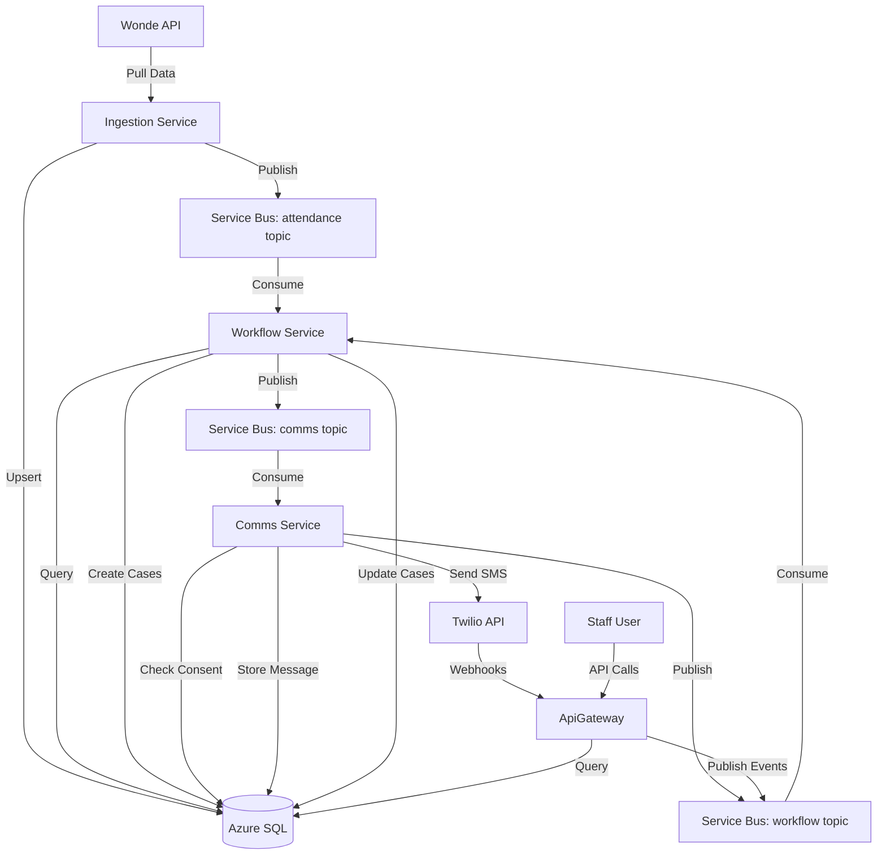

# Anseo Connect v0.1 Development Plan

## Overview

Build the first end-to-end "attendance improvement loop" for pilot schools in Ireland. This plan implements 6 sequential steps, each with clear acceptance criteria. The system will ingest attendance data from Wonde, detect unexplained absences, send guardian messages via SMS, manage cases, and create safeguarding alerts based on policy packs.

## Architecture Context

### Current State

- **Database entities:** Tenant, School, Student, Guardian, StudentGuardian, AttendanceMark exist in [src/Shared/AnseoConnect.Data](src/Shared/AnseoConnect.Data)

- **Contracts:** MessageEnvelope, AttendanceMarksIngestedV1, SendMessageRequestedV1, and other events/commands defined in [src/Shared/AnseoConnect.Contracts](src/Shared/AnseoConnect.Contracts)

- **Multi-tenancy:** TenantContext, query filters, and write enforcement implemented in [src/Shared/AnseoConnect.Data/AnseoConnectDbContext.cs](src/Shared/AnseoConnect.Data/AnseoConnectDbContext.cs)

- **Services scaffolded:** ApiGateway, Ingestion.Wonde, Workflow, Comms (basic Program.cs only)

- **Policy packs:** Schema validation and testing tools exist in [tools/PolicyPackTool](tools/PolicyPackTool)

### Missing Components

- Authentication infrastructure (Entra + Local JWT)

- Service Bus messaging abstraction and implementation

- Case management entities (Case, CaseTimelineEvent, ConsentState, Message, SafeguardingAlert)

- Wonde API integration (see [Wonde API documentation](https://docs.wonde.com/docs/api/sync/#sdks))

- Twilio SMS integration

- Policy runtime evaluation (load and apply policy packs)

## Implementation Steps

### Step 0: Authentication Baseline

**Goal:** Support Microsoft Entra ID (SSO) and local username/password authentication in ApiGateway.

**Files to Create/Modify:**

- [src/Services/AnseoConnect.ApiGateway/Program.cs](src/Services/AnseoConnect.ApiGateway/Program.cs) - Add auth configuration

- [src/Shared/AnseoConnect.Data/Entities/AppUser.cs](src/Shared/AnseoConnect.Data/Entities/AppUser.cs) - New IdentityUser<Guid> entity

- [src/Services/AnseoConnect.ApiGateway/Controllers/AuthController.cs](src/Services/AnseoConnect.ApiGateway/Controllers/AuthController.cs) - Login/register endpoints

- [src/Services/AnseoConnect.ApiGateway/Controllers/WhoAmIController.cs](src/Services/AnseoConnect.ApiGateway/Controllers/WhoAmIController.cs) - Test endpoint

**Key Tasks:**

1. Add NuGet packages: `Microsoft.Identity.Web`, `Microsoft.AspNetCore.Identity.EntityFrameworkCore`

2. Create `AppUser` entity inheriting from `IdentityUser<Guid>`, scoped to TenantId/SchoolId

3. Configure DbContext for Identity in [src/Shared/AnseoConnect.Data/AnseoConnectDbContext.cs](src/Shared/AnseoConnect.Data/AnseoConnectDbContext.cs)

4. Configure dual auth schemes in Program.cs:

- Entra: `AddMicrosoftIdentityWebApi()`

- Local: JWT Bearer token issuance

5. Create `POST /auth/local/login` endpoint returning JWT

6. Create `GET /auth/whoami` endpoint returning user claims (TenantId, SchoolId, UserId)

7. Add `StaffOnly` authorization policy

8. Migration: Add Identity tables

**Acceptance Criteria:**

- Entra token can access protected endpoint

- Local login returns JWT and can access same endpoint

- No secrets committed (use environment variables)

- Solution compiles

---

### Step 1: Service Bus Wiring

**Goal:** Standardize message publishing/consumption across services with tenant correlation and dead-letter handling.

**Files to Create/Modify:**

- [src/Shared/AnseoConnect.Shared/IMessageBus.cs](src/Shared/AnseoConnect.Shared/IMessageBus.cs) - Abstraction interface

- [src/Shared/AnseoConnect.Shared/ServiceBusMessageBus.cs](src/Shared/AnseoConnect.Shared/ServiceBusMessageBus.cs) - Azure Service Bus implementation

- [src/Shared/AnseoConnect.Shared/ServiceBusMessageConsumer.cs](src/Shared/AnseoConnect.Shared/ServiceBusMessageConsumer.cs) - Background service for consuming

- [src/Services/AnseoConnect.Ingestion.Wonde/Program.cs](src/Services/AnseoConnect.Ingestion.Wonde/Program.cs) - Wire up message bus

- [src/Services/AnseoConnect.Workflow/Program.cs](src/Services/AnseoConnect.Workflow/Program.cs) - Wire up consumer

**Key Tasks:**

1. Create `IMessageBus` interface with `PublishAsync<T>(MessageEnvelope<T> envelope)` method

2. Implement `ServiceBusMessageBus` using `Azure.Messaging.ServiceBus`:

- Use System.Text.Json for serialization

- Set topic name from message type mapping

- Include TenantId, SchoolId, CorrelationId in message application properties

3. Implement consumer background service:

- Read from envelope and set TenantContext before processing

- Configure dead-letter handling

- Support cancellation tokens

4. Add message type to topic mapping:

- `AttendanceMarksIngestedV1` → topic: `attendance`

- `SendMessageRequestedV1` → topic: `comms`

- Workflow events → topic: `workflow`

5. Create sample publisher in Ingestion service

6. Create sample consumer in Workflow service (log received message)

**Configuration:**

- Environment variable: `ANSEO_SERVICEBUS` (connection string)

- Topic naming convention: lowercase with hyphens (e.g., `attendance`, `comms`)

**Acceptance Criteria:**

- Ingestion can publish `AttendanceMarksIngestedV1` message

- Workflow consumes message and logs payload

- TenantContext is correctly set from envelope in consumer

- Dead-letter queue configured for poison messages

- Solution compiles

---

### Step 2: Wonde Ingestion Skeleton

**Goal:** Pull students, guardians, and AM/PM attendance marks from Wonde API and publish ingestion events.

**Files to Create/Modify:**

- [src/Services/AnseoConnect.Ingestion.Wonde/Client/IWondeClient.cs](src/Services/AnseoConnect.Ingestion.Wonde/Client/IWondeClient.cs) - Wonde API abstraction

- [src/Services/AnseoConnect.Ingestion.Wonde/Client/WondeClient.cs](src/Services/AnseoConnect.Ingestion.Wonde/Client/WondeClient.cs) - Implementation

- [src/Services/AnseoConnect.Ingestion.Wonde/Models/WondeStudent.cs](src/Services/AnseoConnect.Ingestion.Wonde/Models/WondeStudent.cs) - Response DTOs

- [src/Services/AnseoConnect.Ingestion.Wonde/Models/WondeContact.cs](src/Services/AnseoConnect.Ingestion.Wonde/Models/WondeContact.cs) - Response DTOs

- [src/Services/AnseoConnect.Ingestion.Wonde/Models/WondeAttendance.cs](src/Services/AnseoConnect.Ingestion.Wonde/Models/WondeAttendance.cs) - Response DTOs

- [src/Services/AnseoConnect.Ingestion.Wonde/Services/IngestionService.cs](src/Services/AnseoConnect.Ingestion.Wonde/Services/IngestionService.cs) - Orchestration

- [src/Services/AnseoConnect.Ingestion.Wonde/Controllers/IngestionController.cs](src/Services/AnseoConnect.Ingestion.Wonde/Controllers/IngestionController.cs) - Manual trigger endpoint

- [src/Shared/AnseoConnect.Data/AnseoConnectDbContext.cs](src/Shared/AnseoConnect.Data/AnseoConnectDbContext.cs) - Verify indexes exist

**Wonde API Documentation Reference:**

Based on [Wonde API documentation](https://docs.wonde.com/docs/api/sync/#sdks):

1. **Regional Domains:**

   - UK/world: `api.wonde.com`
   - Australia/NZ: `api-ap-southeast-2.wonde.com`
   - South Africa: `api-af-south-1.wonde.com`
   - US: `api-us-west-2.wonde.com`
   - Ireland schools (v0.1) use `api.wonde.com`
   - Domain available via `/v1.0/schools/{school_id}` endpoint `region` object

2. **Authentication:**

   - Preferred: Bearer token in `Authorization: Bearer {token}` header
   - Alternative: Basic auth with token as username, empty password (include colon)
   - Store token in environment variable `WONDE_TOKEN`

3. **Base URL Format:**

   - `https://{domain}/v1.0/schools/{school_id}/{resource}`
   - Example: `https://api.wonde.com/v1.0/schools/A1329183376/students`

4. **Endpoints:**

   - Students: `GET /v1.0/schools/{school_id}/students`
   - Contacts (guardians): `GET /v1.0/schools/{school_id}/contacts`
   - Attendance marks: `GET /v1.0/schools/{school_id}/attendance`
   - Student absences: `GET /v1.0/schools/{school_id}/attendance/absence`
   - School info: `GET /v1.0/schools/{school_id}` (to get region/domain)

5. **Pagination:**

   - Default: Offset pagination (50 per page, configurable with `?per_page={n}`)
   - Recommended: Cursor pagination (`?cursor=true`) for large datasets
   - Response includes `meta.pagination` with `next`, `previous`, `more`, `per_page`, `current_page`
   - Handle pagination: follow `next` URL until `more: false`

6. **Date Filtering:**

   - Incremental sync: `?updated_after=2025-10-27 05:10:39&updated_before=2025-11-04 12:11:00`
   - Use ISO format dates
   - For initial sync: omit dates; for incremental: store last sync timestamp

7. **Includes (Related Data):**

   - Use `?include=contacts,contacts.contact_details` for nested data
   - Check `meta.includes` in response for available includes
   - For contacts: include contact_details to get phone/email

8. **ID Format:**

   - Simple: `A1161584171`
   - Compound: `{school_id}-{object_id}` (e.g., `A1329183376-A1161584171`)
   - Store in `ExternalStudentId` / `ExternalGuardianId` as-is
   - Wonde IDs are unique per resource type but not across types

**Key Tasks:**

1. Create Wonde client wrapper (`WondeClient`):

   - **Configuration:** Read `WONDE_TOKEN` from environment, support per-school domain lookup
   - **Authentication:** Use Bearer token: `Authorization: Bearer {token}`
   - **HTTP Client:** Use `HttpClient` with proper base address construction
   - **Pagination Handler:** Implement cursor pagination for all list endpoints (recommended for ingestion)
   - **Error Handling:** Handle 400 (Bad Request), 401 (Unauthorized), 404 (Not Found), 500 (Server Error)
   - **Rate Limiting:** Implement retry with exponential backoff for 429 (Too Many Requests)

2. Implement API methods:

   - `GetSchoolAsync(string schoolId, CancellationToken ct)` - Get school info (includes region/domain)
   - `GetStudentsAsync(string schoolId, DateTimeOffset? updatedAfter = null, CancellationToken ct = default)` - Paginated students
   - `GetContactsAsync(string schoolId, DateTimeOffset? updatedAfter = null, CancellationToken ct = default)` - Paginated contacts (include contact_details)
   - `GetAttendanceAsync(string schoolId, DateOnly date, CancellationToken ct = default)` - Attendance marks for specific date
   - `GetStudentAbsencesAsync(string schoolId, DateOnly? fromDate = null, DateOnly? toDate = null, CancellationToken ct = default)` - Absence records

3. Implement ingestion service:

   - **Students:**
     - Map Wonde student `id` to `ExternalStudentId`
     - Map `forename` to `FirstName`, `surname` to `LastName`
     - Map `year_group.name` to `YearGroup`
     - Upsert by `(TenantId, SchoolId, ExternalStudentId)` - use existing unique index

   - **Guardians (Contacts):**
     - Map Wonde contact `id` to `ExternalGuardianId`
     - Map `forename` + `surname` to `FullName`
     - Extract `contact_details` for phone/email (filter by type: `mobile`, `email`)
     - Parse phone to E.164 format (`MobileE164`)
     - Upsert by `(TenantId, SchoolId, ExternalGuardianId)` - use existing unique index

   - **Student-Guardian Relationships:**
     - Wonde students include `contacts` relationship
     - Create `StudentGuardian` records linking StudentId to GuardianId
     - Handle `relationship` field if available in Wonde response

   - **Attendance Marks:**
     - Map Wonde attendance to AM/PM sessions:
       - Use `period.name` or `period.code` to determine AM/PM
       - Default to AM if not determinable (handle in mapping)
     - Map Wonde status codes to internal status:
       - `present` → `PRESENT`
       - `absent` → `ABSENT`
       - `late` → `LATE` (if supported)
       - `unknown` → `UNKNOWN`
     - Map `absence.reason.code` to `ReasonCode` (if present)
     - Upsert by `(TenantId, SchoolId, StudentId, Date, Session)` - use existing unique index
     - Use `attendance.date` for Date, extract session from period

4. Add manual trigger endpoint:

   - `POST /ingestion/run?schoolId={guid}&date={yyyy-MM-dd}` - Optional date parameter for historical sync
   - Default to today's date if not provided
   - Protect with `[Authorize(Policy = "StaffOnly")]`
   - Return summary: `{ studentCount, guardianCount, markCount, duration }`

5. Publish `AttendanceMarksIngestedV1` event after successful ingestion:

   - Include Date (ingested date), StudentCount, MarkCount, Source="WONDE"
   - Publish to Service Bus `attendance` topic
   - Only publish if marks were actually ingested (not on empty results)

6. Handle errors gracefully:

   - Log all API errors with context (schoolId, endpoint, status code)
   - Do not crash service on individual record failures
   - Continue processing remaining records
   - Return partial success if some records fail

**Idempotency:**

- All upserts use existing unique indexes - EF Core will handle conflicts
- Use `FirstOrDefault` + update/create pattern (EF Core will handle concurrency)
- For relationships: Check existence before creating (StudentGuardian)

**Incremental Sync Strategy:**

- Store last sync timestamp per school in DB (add `LastSyncUtc` to School entity)
- On subsequent runs, use `updated_after` parameter with last sync timestamp
- Initial sync: fetch all records
- Incremental sync: fetch only updated records since last sync

**Configuration:**

- Environment variables:
  - `WONDE_TOKEN` - API access token (required)
  - `WONDE_DEFAULT_DOMAIN` - Default domain (optional, defaults to `api.wonde.com`)
- Per-tenant settings (stored in School entity):
  - `WondeSchoolId` - Already exists in School entity
  - `WondeDomain` - Regional domain (optional, fetched from API if not set)

**Acceptance Criteria:**

- Running ingestion twice creates no duplicate records
- Attendance marks update cleanly if already exist (idempotent upserts)
- Students and guardians upsert correctly with relationships
- Event published to Service Bus after ingestion (only if marks ingested)
- Manual trigger endpoint works with optional date parameter (protect with StaffOnly policy)
- Pagination handled correctly (cursor pagination for large datasets)
- Solution compiles
- Handles API errors gracefully (log and continue)

---

### Step 3: Comms Service Skeleton (SMS First)

**Goal:** Consume message requests, enforce consent, send SMS via Twilio, handle webhooks, and manage opt-outs.

**Files to Create/Modify:**

- [src/Shared/AnseoConnect.Data/Entities/ConsentState.cs](src/Shared/AnseoConnect.Data/Entities/ConsentState.cs) - New entity

- [src/Shared/AnseoConnect.Data/Entities/Message.cs](src/Shared/AnseoConnect.Data/Entities/Message.cs) - New entity (outbound messages)

- [src/Shared/AnseoConnect.Data/AnseoConnectDbContext.cs](src/Shared/AnseoConnect.Data/AnseoConnectDbContext.cs) - Add DbSets

- [src/Shared/AnseoConnect.PolicyRuntime/IConsentEvaluator.cs](src/Shared/AnseoConnect.PolicyRuntime/IConsentEvaluator.cs) - Policy evaluation interface

- [src/Shared/AnseoConnect.PolicyRuntime/ConsentEvaluator.cs](src/Shared/AnseoConnect.PolicyRuntime/ConsentEvaluator.cs) - Load policy pack and evaluate

- [src/Services/AnseoConnect.Comms/Services/MessageService.cs](src/Services/AnseoConnect.Comms/Services/MessageService.cs) - Main orchestration

- [src/Services/AnseoConnect.Comms/Services/TwilioSender.cs](src/Services/AnseoConnect.Comms/Services/TwilioSender.cs) - Twilio integration

- [src/Services/AnseoConnect.Comms/Program.cs](src/Services/AnseoConnect.Comms/Program.cs) - Wire up consumer

- [src/Services/AnseoConnect.ApiGateway/Controllers/TwilioWebhookController.cs](src/Services/AnseoConnect.ApiGateway/Controllers/TwilioWebhookController.cs) - Webhooks (confirmed: hosted in ApiGateway)

**Key Tasks:**

1. Create `ConsentState` entity:

- Primary key: `(TenantId, SchoolId, GuardianId, Channel)`

- State: `UNKNOWN`, `OPTED_IN`, `OPTED_OUT`

- LastUpdatedUtc, Source

2. Create `Message` entity:

- MessageId, CaseId, StudentId, GuardianId

- Channel, Status (PENDING, SENT, DELIVERED, FAILED)

- ProviderMessageId, Body, CreatedAtUtc
- Scoped to TenantId/SchoolId

3. Implement consent evaluator:

- Load policy pack for tenant (from Tenant.DefaultPolicyPackId/Version)

- Evaluate consent using same logic as PolicyPackTool (ComputeConsentAllowed)

- SMS: allowed unless OPTED_OUT

- WhatsApp/Voice: blocked unless OPTED_IN

4. Implement Twilio sender:

- Send SMS using Twilio SDK

- Store ProviderMessageId from Twilio response

- Handle Twilio exceptions

5. Create message service consumer:

- Consume `SendMessageRequestedV1` from Service Bus

- Check consent (load policy + query ConsentState)

- If allowed: send via Twilio, persist Message, publish `MessageDeliveryUpdatedV1`

- If blocked: log audit trail, optionally persist blocked attempt

6. Implement webhooks in ApiGateway:

- `POST /webhooks/twilio/delivery` → parse status, publish `MessageDeliveryUpdatedV1`

- `POST /webhooks/twilio/reply` → parse inbound SMS, publish `GuardianReplyReceivedV1`

7. Implement opt-out detection:

- In reply handler: check for opt-out keywords (e.g., "STOP", "UNSUBSCRIBE")

- Update ConsentState to OPTED_OUT

- Publish `GuardianOptOutRecordedV1` event

8. Migration: Add ConsentState and Message tables

**Policy Pack Integration:**

- Load policy pack JSON from `policy-packs/{countryCode}/{policyPackId}/{version}/*.json`

- Use PolicyRuntime to evaluate consent rules (reuse PolicyPackTool logic)

**Configuration:**

- Environment variables: `TWILIO_ACCOUNT_SID`, `TWILIO_AUTH_TOKEN`, `TWILIO_FROM_NUMBER`

**Acceptance Criteria:**

- `SendMessageRequestedV1` results in either:

- Message sent and `MessageDeliveryUpdatedV1` published, OR

- Blocked due to consent with audit log

- Delivery webhook updates message status

- Reply webhook creates event and triggers opt-out if keywords match

- Solution compiles and policy validation passes

---

### Step 4: Workflow (Unexplained Absences + Cases)

**Goal:** Detect unexplained absences after cutoff, create cases, request messages, and create safeguarding alerts.

**Files to Create/Modify:**

- [src/Shared/AnseoConnect.Data/Entities/Case.cs](src/Shared/AnseoConnect.Data/Entities/Case.cs) - New entity

- [src/Shared/AnseoConnect.Data/Entities/CaseTimelineEvent.cs](src/Shared/AnseoConnect.Data/Entities/CaseTimelineEvent.cs) - New entity

- [src/Shared/AnseoConnect.Data/Entities/SafeguardingAlert.cs](src/Shared/AnseoConnect.Data/Entities/SafeguardingAlert.cs) - New entity

- [src/Shared/AnseoConnect.Data/AnseoConnectDbContext.cs](src/Shared/AnseoConnect.Data/AnseoConnectDbContext.cs) - Add DbSets

- [src/Services/AnseoConnect.Workflow/Services/AbsenceDetectionService.cs](src/Services/AnseoConnect.Workflow/Services/AbsenceDetectionService.cs) - Core logic

- [src/Services/AnseoConnect.Workflow/Services/CaseService.cs](src/Services/AnseoConnect.Workflow/Services/CaseService.cs) - Case management

- [src/Services/AnseoConnect.Workflow/Services/SafeguardingService.cs](src/Services/AnseoConnect.Workflow/Services/SafeguardingService.cs) - Policy evaluation

- [src/Shared/AnseoConnect.PolicyRuntime/ISafeguardingEvaluator.cs](src/Shared/AnseoConnect.PolicyRuntime/ISafeguardingEvaluator.cs) - Interface

- [src/Shared/AnseoConnect.PolicyRuntime/SafeguardingEvaluator.cs](src/Shared/AnseoConnect.PolicyRuntime/SafeguardingEvaluator.cs) - Implementation (reuse PolicyPackTool.ComputeSafeguarding)

- [src/Services/AnseoConnect.Workflow/Program.cs](src/Services/AnseoConnect.Workflow/Program.cs) - Wire up consumer

**Key Tasks:**

1. Create `Case` entity:

- CaseId, StudentId, CaseType (ATTENDANCE, SAFEGUARDING)

- Tier (1, 2, 3), Status (OPEN, CLOSED, ESCALATED)

- CreatedAtUtc, ResolvedAtUtc

- Scoped to TenantId/SchoolId

2. Create `CaseTimelineEvent` entity:

- EventId, CaseId, EventType, EventData (JSON)

- CreatedAtUtc, CreatedBy (optional)

3. Create `SafeguardingAlert` entity:

- AlertId, CaseId, Severity, ChecklistId

- RequiresHumanReview (bool), ReviewedAtUtc, ReviewedBy

4. Implement cutoff time logic:

- Read from School config or policy pack (default: 10:00 AM)

- Use School.Timezone for timezone conversion

5. Implement absence detection:

- Query today's attendance marks after cutoff

- Filter: Status = ABSENT or UNKNOWN, ReasonCode is null or not in accepted reasons

- Group by StudentId

6. Implement case creation:

- Check if OPEN ATTENDANCE case exists for student

- If not, create new case (Tier 1)

- Create timeline event: "ABSENCE_DETECTED"

7. Implement message request:

- Select primary guardian (first StudentGuardian, or guardian with IsPrimary flag if exists)

- Publish `SendMessageRequestedV1` with template data (student name, date, etc.)

8. Implement Tier 2 escalation:

- Evaluate policy pack (attendancePlanPlaybook.checklists)

- If threshold met (simple: case age > X days or absences > Y), require checklist completion

- Update case to Tier 2 if checklist completed

9. Implement safeguarding evaluation:

- Compute metrics: guardianNoReplyDays, consecutiveAbsenceDays, etc.

- Load policy pack and evaluate using SafeguardingEvaluator (same logic as PolicyPackTool.ComputeSafeguarding)

- If trigger matches, create SafeguardingAlert and publish `SafeguardingAlertCreatedV1`

10. Consumer implementation:

    - Consume `AttendanceMarksIngestedV1` from Service Bus

    - Set TenantContext from envelope

    - Run absence detection for ingested date

    - Create cases and request messages

11. Migration: Add Case, CaseTimelineEvent, SafeguardingAlert tables

**Policy Pack Integration:**

- Load policy pack for tenant

- Evaluate cutoff times, Tier 2 thresholds, safeguarding triggers

- Use PolicyRuntime evaluators (reuse PolicyPackTool logic)

**Acceptance Criteria:**

- After `AttendanceMarksIngestedV1`, workflow detects today's unexplained absences

- Cases created with timeline events

- Message requests published for each absence

- Tier 2 escalation works when policy conditions met

- Safeguarding alerts created when test-like metrics match policy triggers
- Solution compiles and policy validation passes

---

### Step 5: Minimal Staff Endpoints

**Goal:** Provide basic API endpoints for staff to view cases, absences, consent status, and update checklists.

**Files to Create/Modify:**

- [src/Services/AnseoConnect.ApiGateway/Controllers/CasesController.cs](src/Services/AnseoConnect.ApiGateway/Controllers/CasesController.cs) - Case endpoints

- [src/Services/AnseoConnect.ApiGateway/Controllers/AbsencesController.cs](src/Services/AnseoConnect.ApiGateway/Controllers/AbsencesController.cs) - Absence listing

- [src/Services/AnseoConnect.ApiGateway/Controllers/ConsentController.cs](src/Services/AnseoConnect.ApiGateway/Controllers/ConsentController.cs) - Consent status

- [src/Shared/AnseoConnect.Contracts/DTOs/CaseDto.cs](src/Shared/AnseoConnect.Contracts/DTOs/CaseDto.cs) - Response DTOs

- [src/Shared/AnseoConnect.Contracts/DTOs/AbsenceDto.cs](src/Shared/AnseoConnect.Contracts/DTOs/AbsenceDto.cs) - Response DTOs

- [src/Services/AnseoConnect.ApiGateway/Services/CaseQueryService.cs](src/Services/AnseoConnect.ApiGateway/Services/CaseQueryService.cs) - Query logic (calls Data project)

**Key Tasks:**

1. Create DTOs (do not expose entities):

- `CaseDto`, `CaseTimelineEventDto`, `AbsenceDto`, `ConsentStatusDto`

2. Implement query service:

- Use AnseoConnectDbContext with TenantContext set from auth claims

- Project to DTOs (use `Select` to avoid N+1)

- Apply `AsNoTracking()` for reads

3. Create endpoints:

- `GET /api/cases?status=OPEN` - List open cases (paged)

- `GET /api/cases/{caseId}` - Get case details with timeline

- `GET /api/absences/today` - List today's unexplained absences

- `GET /api/consent/{guardianId}?channel=SMS` - Get consent status

- `PATCH /api/cases/{caseId}/checklist/{checklistId}/complete` - Mark checklist item complete (placeholder for v0.2)

4. All endpoints protected with `[Authorize(Policy = "StaffOnly")]`

5. TenantContext automatically set from JWT claims (TenantId, SchoolId)

**Acceptance Criteria:**

- Staff can list open cases via API

- Staff can view case timeline

- Staff can see today's unexplained absences

- Staff can check guardian consent status

- All endpoints respect tenant/school isolation

- Solution compiles

---

## Common Patterns & Rules

### DevExpress Component Development

**IMPORTANT:** When implementing DevExpress components (for future UI work or any DevExpress-related code):

- **Always use DevExpress MCP Server (dxdocs)** to search for component documentation, examples, and best practices
- Use `mcp_dxdocs_devexpress_docs_search` to find relevant DevExpress documentation before implementing components
- Use `mcp_dxdocs_devexpress_docs_get_content` to get full documentation when a specific URL is identified
- Follow DevExpress patterns and conventions for Blazor components
- Reference official DevExpress examples and code samples for implementation guidance

**When to use:**

- Implementing DevExpress Blazor components (data grids, forms, editors, reports)
- Configuring DevExpress themes or styling
- Working with DevExpress reporting (XtraReports)
- Setting up DevExpress dashboard components
- Any DevExpress-specific configuration or customization

**Note:** v0.1 does not include UI components, but this rule applies to all future UI development and any DevExpress integration work.

### Multi-Tenancy

- **Always** set TenantContext from auth claims (API) or Service Bus envelope (background services)

- Use query filters in DbContext (already implemented)

- Write enforcement ensures TenantId/SchoolId set server-side only

### Service Bus

- All messages use `MessageEnvelope<T>` with TenantId, SchoolId, CorrelationId
- Topics: `attendance`, `comms`, `workflow`

- Consumers set TenantContext before any DB operations

### Policy Packs

- Load from `policy-packs/{countryCode}/{policyPackId}/{version}/`

- Tenant references specific version via `Tenant.DefaultPolicyPackId/Version`

- Reuse PolicyPackTool evaluation logic in PolicyRuntime

### Database Migrations

- After each step that adds entities, create migration:

- `dotnet ef migrations add Step{N}_Add{EntityName} --project src/Shared/AnseoConnect.Data --startup-project src/Services/AnseoConnect.ApiGateway`

- Apply migration: use DBMigrator tool or `dotnet ef database update`

### Initial Data Setup

**Prerequisites for testing (after Step 0 - Auth):**

1. Create initial Tenant:

   - Use SQL script or seed data in migration/tool
   - Set `CountryCode` = "IE", `DefaultPolicyPackId` = "IE-ANSEO-DEFAULT", `DefaultPolicyPackVersion` = "1.2.0"

2. Create initial School:

   - Link to Tenant via `TenantId`
   - Set `WondeSchoolId` from Wonde API (or test value)
   - Set `SISProvider` = "WONDE", `Timezone` = "Europe/Dublin"
   - Store `Name` from Wonde API

3. Create initial staff user (local auth):

   - Use admin-only registration endpoint or SQL script
   - Associate with Tenant and School
   - Store credentials securely (environment variable or user secrets for development)

4. Configure Wonde credentials:

   - Store `WONDE_TOKEN` in environment variables
   - Verify `WONDE_SCHOOL_ID` matches School.WondeSchoolId

**Note:** Consider creating a seed data tool or migration for initial tenant/school setup for local development.

### Testing & Validation

- After each step:

- Build solution (`dotnet build`)

- Run policy validation: `dotnet run --project tools/PolicyPackTool validate policy-packs`

- Run policy tests: `dotnet run --project tools/PolicyPackTool test policy-packs`

- Provide "how to run locally" instructions

### Secrets Management

- **Never** commit secrets

- Use environment variables (local development) or Azure Key Vault (production)

- Document required environment variables in README

### Error Handling & Logging

- Use structured logging (default `ILogger<T>` is acceptable for v0.1)
- Log all errors with context (TenantId, SchoolId, correlation IDs)
- Use `ProblemDetails` for API error responses (standard ASP.NET Core)
- Implement global exception handling middleware if needed
- Log Service Bus message processing failures with full context

### Health Checks (Recommended for Production)

- Add health check endpoints to each service (optional for v0.1)
- Check database connectivity
- Check Service Bus connectivity
- Check external service connectivity (Wonde, Twilio) - use minimal checks
- Endpoint: `GET /health` (standard ASP.NET Core health checks)

### Configuration Management

- Use `IConfiguration` with `appsettings.json` and environment variables
- Store connection strings in environment variables (never in appsettings.json committed to repo)
- Use strongly-typed configuration classes where appropriate (IOptions pattern)
- Support development vs production configuration via `appsettings.Development.json`

### Dependency Injection Patterns

- Register services with appropriate lifetimes:
  - Transient: Stateless services, HTTP clients
  - Scoped: DbContext, services with per-request state
  - Singleton: Message bus client, configuration services
- Use factory patterns for TenantContext (scoped per request/message)

### API Design Patterns

- Use consistent RESTful naming conventions
- Return appropriate HTTP status codes (200, 201, 204, 400, 401, 403, 404, 500)
- Use DTOs for all API responses (never expose entities directly)
- Support pagination for list endpoints (use standard `skip`/`take` or cursor-based)
- Include correlation IDs in response headers for debugging

### External API References

- **Wonde API:** [Official Wonde API Documentation](https://docs.wonde.com/docs/api/sync/#sdks)
  - Regional domains, authentication, pagination, date filtering
  - Endpoints: Students, Contacts (guardians), Attendance, Absences
  - See Step 2 for detailed integration requirements

- **DevExpress Documentation:** Use DevExpress MCP Server (dxdocs) for all DevExpress component questions
  - Search: `mcp_dxdocs_devexpress_docs_search`
  - Get content: `mcp_dxdocs_devexpress_docs_get_content`
  - See "DevExpress Component Development" section above

---

## Data Flow Diagram

---

## Additional Considerations & Future Enhancements

### Background Service Patterns

- Use `IHostedService` or `BackgroundService` for Service Bus consumers
- Implement proper cancellation token propagation
- Handle service shutdown gracefully (wait for in-flight messages)
- Consider circuit breaker patterns for external API calls (Wonde, Twilio)

### Idempotency & Retry Strategies

- Service Bus: Configure automatic retry policies and dead-letter queues
- External APIs (Wonde): Implement exponential backoff retry with max attempts
- Database operations: Use transactions for multi-step operations (create case + timeline event)
- Consider idempotency keys for critical operations (store processed correlation IDs)

### Performance & Scalability

- Use async/await consistently (all I/O operations)
- Configure HTTP client connection pooling (`IHttpClientFactory`)
- Database: Use `AsNoTracking()` for read-only queries (already in plan)
- Consider caching for policy packs (in-memory cache per tenant)
- Pagination: Use cursor-based for large datasets (already planned for Wonde)

### Testing Considerations (Not Required for v0.1)

- Unit tests: Business logic, policy evaluation, mapping functions
- Integration tests: Service Bus message flow, database operations
- API tests: Endpoint responses, authentication/authorization
- Policy pack tests: Already implemented in PolicyPackTool

### Security Enhancements (Post v0.1)

- Rate limiting on API endpoints (prevent abuse)
- API versioning strategy (URL path or header-based)
- Request validation middleware (FluentValidation or DataAnnotations)
- Audit logging for sensitive operations (consent changes, case escalations)

### Monitoring & Observability (Post v0.1)

- Application Insights or similar for application telemetry
- Distributed tracing (correlation IDs across services)
- Metrics: Message processing rates, API response times, error rates
- Alerts: Failed Service Bus messages, API errors, external API failures

### CORS Configuration

- Not required for v0.1 (no web UI yet)
- When adding web UI: Configure CORS in ApiGateway for Blazor Web App origin
- Use specific origins (not `*` in production)

### API Documentation

- OpenAPI/Swagger: Already configured via `AddOpenApi()` in scaffolded services
- Document request/response DTOs with XML comments
- Include examples in OpenAPI schema
- Document authentication requirements per endpoint

### Data Retention & Privacy

- Consider soft-delete pattern for entities (add `IsDeleted` flag)
- GDPR considerations: Data export, right to be forgotten (future)
- Audit trail: Track who changed what and when (TenantContext includes user ID)

## Definition of Done

After all steps complete:

- End-to-end loop works for at least one school (Ireland)

- Policy packs govern consent, safeguarding triggers, Tier 2 gating

- All services run locally against SQL Server

- GitHub Actions CI green (policy validation + tests)

- No secrets in repository

- All acceptance criteria met for Steps 0-5

- Documentation: "How to run locally" instructions for each service

- Manual testing: Can trigger ingestion → detect absences → send messages → view cases via API