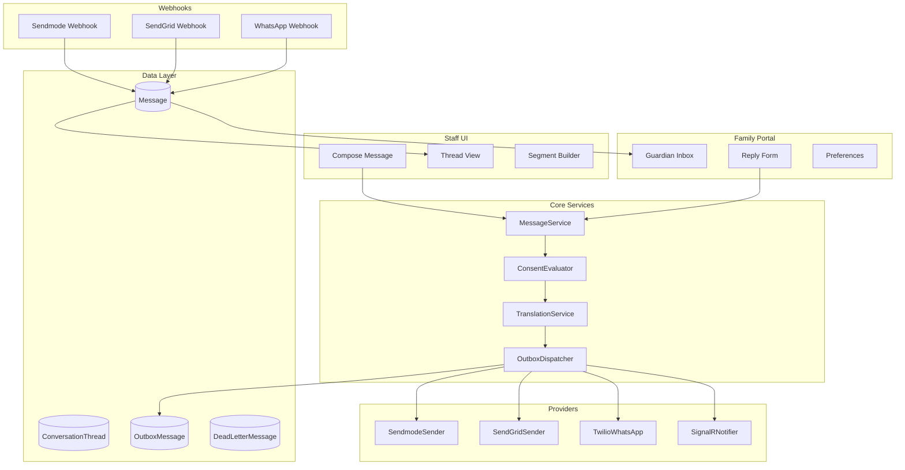
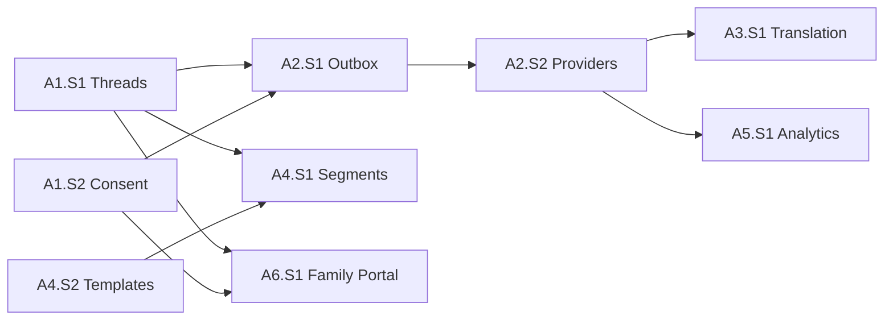

# EPIC A - Communications Hub Implementation Plan

## Current State Summary

The codebase has a foundation for messaging but lacks the full "Communications Hub" capabilities:

**Existing:**

- Basic entities: `Message` (outbound-only), `Guardian`, `StudentGuardian`, `ConsentState`, `MessageTemplate`, `Notification`
- Provider implementations: `SendmodeSender` (SMS), `SendGridEmailSender`, `TwilioWhatsAppSender`
- Webhook controllers for delivery receipts and inbound replies
- Basic template engine with `{{Variable}}` substitution in [`TemplateEngine.cs`](src/Shared/AnseoConnect.PolicyRuntime/TemplateEngine.cs)
- Messages UI page with grid and compose dialog

**Missing (Gap):**

- Conversation threads model (two-way messaging history)
- Transactional outbox with DLQ and idempotency
- Provider abstraction interfaces
- Translation/localization loop
- Contact preferences (quiet hours, language, channel priority)
- Full consent audit trail
- Audience segmentation and campaigns
- Template versioning/approvals/governance
- Engagement analytics and reachability scoring
- Family portal for guardians

---

## Implementation Phases

### Phase 1: Core Data Model (P0 - Foundation)

#### A1.S1 - Conversation Threads

**New Entities to Create:**

```csharp
// ConversationThread.cs
public class ConversationThread : SchoolEntity
{
    public Guid ThreadId { get; set; }
    public Guid? StudentId { get; set; }  // optional, household messages may span students
    public string Status { get; set; }    // OPEN, CLOSED, ARCHIVED
    public string? Tags { get; set; }     // JSON array
    public Guid? OwnerUserId { get; set; }
    public DateTimeOffset LastActivityUtc { get; set; }
    public DateTimeOffset CreatedAtUtc { get; set; }
}

// ConversationParticipant.cs
public class ConversationParticipant : SchoolEntity
{
    public Guid ParticipantId { get; set; }
    public Guid ThreadId { get; set; }
    public string ParticipantType { get; set; }  // STAFF, GUARDIAN
    public Guid ParticipantRefId { get; set; }   // UserId or GuardianId
    public DateTimeOffset JoinedAtUtc { get; set; }
}

// MessageLocalizedText.cs
public class MessageLocalizedText
{
    public Guid LocalizedTextId { get; set; }
    public Guid MessageId { get; set; }
    public string LanguageCode { get; set; }
    public string Body { get; set; }
    public bool IsOriginal { get; set; }
}

// MessageDeliveryAttempt.cs
public class MessageDeliveryAttempt : SchoolEntity
{
    public Guid AttemptId { get; set; }
    public Guid MessageId { get; set; }
    public string Provider { get; set; }
    public string Status { get; set; }
    public string? ProviderMessageId { get; set; }
    public string? ErrorCode { get; set; }
    public DateTimeOffset AttemptedAtUtc { get; set; }
    public string? RawResponseJson { get; set; }
}

// Attachment.cs
public class Attachment : SchoolEntity
{
    public Guid AttachmentId { get; set; }
    public Guid MessageId { get; set; }
    public string FileName { get; set; }
    public string ContentType { get; set; }
    public long SizeBytes { get; set; }
    public string StorageUrl { get; set; }
    public DateTimeOffset UploadedAtUtc { get; set; }
}
```

**Modify Existing `Message` Entity:**

- Add `ThreadId` (nullable FK)
- Add `Direction` (INBOUND/OUTBOUND)
- Add `IsRead` for inbound messages
- Add `IdempotencyKey` for deduplication

**Files to modify:**

- [`src/Shared/AnseoConnect.Data/Entities/Message.cs`](src/Shared/AnseoConnect.Data/Entities/Message.cs)
- [`src/Shared/AnseoConnect.Data/AnseoConnectDbContext.cs`](src/Shared/AnseoConnect.Data/AnseoConnectDbContext.cs)

**New indexes:**

- `IX_Threads_Tenant_School_Student_LastActivity`
- `IX_Messages_ThreadId_CreatedAt`

---

#### A1.S2 - Contact Preferences + Consent

**New Entities:**

```csharp
// ContactPreference.cs
public class ContactPreference : SchoolEntity
{
    public Guid ContactPreferenceId { get; set; }
    public Guid GuardianId { get; set; }
    public string PreferredLanguage { get; set; }  // ISO 639-1
    public string PreferredChannelsJson { get; set; }  // ["SMS","EMAIL","WHATSAPP"]
    public string? QuietHoursJson { get; set; }  // {"start":"21:00","end":"07:00","timezone":"Europe/Dublin"}
    public Guid? UpdatedByUserId { get; set; }
    public DateTimeOffset UpdatedAtUtc { get; set; }
}

// ConsentRecord.cs (audit-friendly, separate from ConsentState)
public class ConsentRecord : SchoolEntity
{
    public Guid ConsentRecordId { get; set; }
    public Guid GuardianId { get; set; }
    public string Channel { get; set; }
    public string Action { get; set; }  // OPTED_IN, OPTED_OUT
    public string Source { get; set; }  // PORTAL, STAFF_OVERRIDE, WEBHOOK, IMPORT
    public string? Notes { get; set; }
    public DateTimeOffset CapturedAtUtc { get; set; }
    public Guid? CapturedByUserId { get; set; }
}
```

**Modify existing `ConsentState`:**

- Keep as the "current state" view
- Update via `ConsentRecord` events (event-sourced pattern)

**Consent enforcement:**

- Already partially exists in [`MessageService.cs`](src/Services/AnseoConnect.Comms/Services/MessageService.cs)
- Enhance to check quiet hours and channel preferences

---

### Phase 2: Messaging Infrastructure (P0 - Reliability)

#### A2.S1 - Transactional Outbox + Dispatcher

**New Entities:**

```csharp
// OutboxMessage.cs
public class OutboxMessage : ITenantScoped
{
    public Guid OutboxMessageId { get; set; }
    public Guid TenantId { get; set; }
    public Guid? SchoolId { get; set; }
    public string Type { get; set; }  // SendSms, SendEmail, SendWhatsApp, SendInApp
    public string PayloadJson { get; set; }
    public string IdempotencyKey { get; set; }
    public string Status { get; set; }  // PENDING, PROCESSING, COMPLETED, FAILED
    public int AttemptCount { get; set; }
    public DateTimeOffset? NextAttemptUtc { get; set; }
    public string? LastError { get; set; }
    public DateTimeOffset CreatedAtUtc { get; set; }
    public byte[] RowVersion { get; set; }  // concurrency
}

// DeadLetterMessage.cs
public class DeadLetterMessage : ITenantScoped
{
    public Guid DeadLetterId { get; set; }
    public Guid TenantId { get; set; }
    public Guid OriginalOutboxId { get; set; }
    public string Type { get; set; }
    public string PayloadJson { get; set; }
    public string FailureReason { get; set; }
    public DateTimeOffset FailedAtUtc { get; set; }
    public DateTimeOffset? ReplayedAtUtc { get; set; }
    public Guid? ReplayedByUserId { get; set; }
}
```

**New Services:**

```csharp
// IOutboxDispatcher.cs
public interface IOutboxDispatcher
{
    Task EnqueueAsync<T>(T message, string idempotencyKey, CancellationToken ct);
}

// OutboxDispatcherService.cs (BackgroundService)
// - Polls OutboxMessage table
// - Per-tenant throttling
// - Exponential backoff
// - Moves to DLQ after max retries
```

**Files to create:**

- `src/Services/AnseoConnect.Comms/Services/OutboxDispatcherService.cs`
- `src/Services/AnseoConnect.Comms/Services/IOutboxDispatcher.cs`

**Refactor `MessageService.cs`:**

- Instead of direct send, write to outbox
- Let dispatcher handle actual send

---

#### A2.S2 - Provider Interfaces

**New Interfaces:**

```csharp
// ISmsProvider.cs
public interface ISmsProvider
{
    string ProviderName { get; }
    Task<SendResult> SendAsync(string to, string body, CancellationToken ct);
}

// IEmailProvider.cs
public interface IEmailProvider
{
    string ProviderName { get; }
    Task<SendResult> SendAsync(string to, string subject, string htmlBody, string plainTextBody, CancellationToken ct);
}

// IWhatsAppProvider.cs
public interface IWhatsAppProvider
{
    string ProviderName { get; }
    Task<SendResult> SendAsync(string to, string body, CancellationToken ct);
}

// IInAppNotifier.cs
public interface IInAppNotifier
{
    Task NotifyAsync(Guid userId, string type, object payload, CancellationToken ct);
}

// SendResult.cs
public record SendResult(bool Success, string? ProviderMessageId, string? Status, string? ErrorCode, string? ErrorMessage);
```

**Refactor existing senders:**

- [`SendmodeSender.cs`](src/Services/AnseoConnect.Comms/Services/SendmodeSender.cs) implements `ISmsProvider`
- [`SendGridEmailSender.cs`](src/Services/AnseoConnect.Comms/Services/SendGridEmailSender.cs) implements `IEmailProvider`
- [`TwilioWhatsAppSender.cs`](src/Services/AnseoConnect.Comms/Services/TwilioWhatsAppSender.cs) implements `IWhatsAppProvider`

**Add In-App Notifications:**

- Create `SignalRNotifier : IInAppNotifier`
- Add SignalR hub for real-time push

---

### Phase 3: Translation + Localization (P1)

#### A3.S1 - Auto-translation Service

**New Interface:**

```csharp
// ITranslationService.cs
public interface ITranslationService
{
    Task<string> TranslateAsync(string text, string fromLanguage, string toLanguage, CancellationToken ct);
    Task<IReadOnlyList<TranslationResult>> TranslateBatchAsync(IEnumerable<string> texts, string fromLanguage, string toLanguage, CancellationToken ct);
}
```

**Implementation options** (configurable per tenant):

- Azure Translator
- Google Cloud Translation
- DeepL

**Translation caching:**

- `TranslationCache` entity with TTL
- Hash-based lookup: `SHA256(text + fromLang + toLang)`

**Workflow:**

1. Staff composes message in default language
2. System detects guardian's `PreferredLanguage`
3. Auto-translate and store `MessageLocalizedText`
4. Optional: "Review translation before send" flag per school
5. Inbound replies: translate to staff's default language

---

### Phase 4: Segmentation + Campaigns + Template Governance (P1)

#### A4.S1 - Audience Segments

**New Entities:**

```csharp
// AudienceSegment.cs
public class AudienceSegment : ITenantScoped
{
    public Guid SegmentId { get; set; }
    public Guid TenantId { get; set; }
    public string Name { get; set; }
    public string FilterDefinitionJson { get; set; }  // {"school":[],"yearGroup":[],"attendanceRisk":true,...}
    public Guid CreatedByUserId { get; set; }
    public DateTimeOffset CreatedAtUtc { get; set; }
}

// AudienceSnapshot.cs
public class AudienceSnapshot : ITenantScoped
{
    public Guid SnapshotId { get; set; }
    public Guid TenantId { get; set; }
    public Guid SegmentId { get; set; }
    public string RecipientIdsJson { get; set; }  // snapshot of who was targeted
    public int RecipientCount { get; set; }
    public DateTimeOffset CreatedAtUtc { get; set; }
}

// Campaign.cs
public class Campaign : ITenantScoped
{
    public Guid CampaignId { get; set; }
    public Guid TenantId { get; set; }
    public string Name { get; set; }
    public Guid SegmentId { get; set; }
    public Guid SnapshotId { get; set; }
    public Guid TemplateVersionId { get; set; }
    public string Status { get; set; }  // DRAFT, SCHEDULED, SENDING, COMPLETED
    public DateTimeOffset? ScheduledAtUtc { get; set; }
    public DateTimeOffset CreatedAtUtc { get; set; }
}
```

**Segment Query Engine:**

- Service that evaluates segment filters against student/guardian data
- Supports: school, year group, class, attendance risk flags, case status, tags

---

#### A4.S2 - Template Versioning + Approvals

**Modify `MessageTemplate` Entity:**

```csharp
// Add to MessageTemplate.cs
public int Version { get; set; }
public string Status { get; set; }  // DRAFT, PENDING_APPROVAL, APPROVED, RETIRED
public Guid? ApprovedByUserId { get; set; }
public DateTimeOffset? ApprovedAtUtc { get; set; }
public string? MergeFieldSchemaJson { get; set; }
public string LockScope { get; set; }  // DISTRICT_ONLY, SCHOOL_OVERRIDE_ALLOWED
public Guid? ParentTemplateId { get; set; }  // for school overrides
```

**Workflow:**

1. District creates locked templates (LockScope = DISTRICT_ONLY)
2. Schools can create overrides if allowed
3. Changes require approval workflow
4. Sends bind to specific approved version

---

### Phase 5: Engagement Analytics + Reachability (P1)

#### A5.S1 - Engagement Metrics Pipeline

**New Entities:**

```csharp
// EngagementEvent.cs
public class EngagementEvent : ITenantScoped
{
    public Guid EventId { get; set; }
    public Guid TenantId { get; set; }
    public Guid MessageId { get; set; }
    public Guid GuardianId { get; set; }
    public string EventType { get; set; }  // DELIVERED, OPENED, CLICKED, REPLIED, FAILED, BOUNCED
    public DateTimeOffset OccurredAtUtc { get; set; }
    public string? MetadataJson { get; set; }
}

// GuardianReachability.cs
public class GuardianReachability : SchoolEntity
{
    public Guid ReachabilityId { get; set; }
    public Guid GuardianId { get; set; }
    public string Channel { get; set; }
    public int TotalSent { get; set; }
    public int TotalDelivered { get; set; }
    public int TotalFailed { get; set; }
    public int TotalReplied { get; set; }
    public decimal ReachabilityScore { get; set; }  // 0-100
    public DateTimeOffset LastUpdatedUtc { get; set; }
}
```

**Enhancements:**

- Add email open/click tracking (SendGrid tracking pixel/links)
- Add reply detection
- Build "Unreachable Families" work queue
- Create engagement dashboards

---

### Phase 6: Family Portal (P1)

#### A6.S1 - Guardian Authentication + Portal

**Authentication:**

- Magic link email flow (primary)
- Optional: OTP via SMS
- Optional: District SSO integration

**New Project:**

- `src/Web/AnseoConnect.FamilyPortal/` - Blazor WebAssembly or Server
- Separate host from staff app

**Portal Pages:**

- `/inbox` - Message threads
- `/thread/{id}` - Conversation view with reply
- `/documents` - Received documents/letters
- `/preferences` - Language, channel, quiet hours
- `/consent` - Consent management

**API Endpoints:**

- `GET /api/guardian/threads` - Guardian's threads
- `GET /api/guardian/threads/{id}/messages` - Messages in thread
- `POST /api/guardian/threads/{id}/reply` - Send reply
- `GET /api/guardian/documents` - Documents
- `GET/PUT /api/guardian/preferences` - Preferences
- `GET/PUT /api/guardian/consent` - Consent

---

## Data Flow Diagram



---

## Dependencies and Ordering



---

## Key Files to Create/Modify

**New Entity Files:**

- `src/Shared/AnseoConnect.Data/Entities/ConversationThread.cs`
- `src/Shared/AnseoConnect.Data/Entities/ConversationParticipant.cs`
- `src/Shared/AnseoConnect.Data/Entities/MessageLocalizedText.cs`
- `src/Shared/AnseoConnect.Data/Entities/MessageDeliveryAttempt.cs`
- `src/Shared/AnseoConnect.Data/Entities/Attachment.cs`
- `src/Shared/AnseoConnect.Data/Entities/ContactPreference.cs`
- `src/Shared/AnseoConnect.Data/Entities/ConsentRecord.cs`
- `src/Shared/AnseoConnect.Data/Entities/OutboxMessage.cs`
- `src/Shared/AnseoConnect.Data/Entities/DeadLetterMessage.cs`
- `src/Shared/AnseoConnect.Data/Entities/AudienceSegment.cs`
- `src/Shared/AnseoConnect.Data/Entities/AudienceSnapshot.cs`
- `src/Shared/AnseoConnect.Data/Entities/Campaign.cs`
- `src/Shared/AnseoConnect.Data/Entities/EngagementEvent.cs`
- `src/Shared/AnseoConnect.Data/Entities/GuardianReachability.cs`
- `src/Shared/AnseoConnect.Data/Entities/TranslationCache.cs`

**New Service Files:**

- `src/Services/AnseoConnect.Comms/Services/IOutboxDispatcher.cs`
- `src/Services/AnseoConnect.Comms/Services/OutboxDispatcherService.cs`
- `src/Services/AnseoConnect.Comms/Services/ISmsProvider.cs`
- `src/Services/AnseoConnect.Comms/Services/IEmailProvider.cs`
- `src/Services/AnseoConnect.Comms/Services/IWhatsAppProvider.cs`
- `src/Services/AnseoConnect.Comms/Services/IInAppNotifier.cs`
- `src/Services/AnseoConnect.Comms/Services/SignalRNotifier.cs`
- `src/Services/AnseoConnect.Comms/Services/ITranslationService.cs`
- `src/Services/AnseoConnect.Comms/Services/AzureTranslatorService.cs`
- `src/Services/AnseoConnect.Comms/Services/SegmentQueryEngine.cs`
- `src/Services/AnseoConnect.Comms/Services/EngagementTrackingService.cs`

**Modify Existing:**

- [`src/Shared/AnseoConnect.Data/Entities/Message.cs`](src/Shared/AnseoConnect.Data/Entities/Message.cs) - Add ThreadId, Direction, IdempotencyKey
- [`src/Shared/AnseoConnect.Data/Entities/MessageTemplate.cs`](src/Shared/AnseoConnect.Data/Entities/MessageTemplate.cs) - Add versioning fields
- [`src/Shared/AnseoConnect.Data/AnseoConnectDbContext.cs`](src/Shared/AnseoConnect.Data/AnseoConnectDbContext.cs) - Add new DbSets
- [`src/Services/AnseoConnect.Comms/Services/MessageService.cs`](src/Services/AnseoConnect.Comms/Services/MessageService.cs) - Refactor to use outbox
- [`src/Services/AnseoConnect.Comms/Services/SendmodeSender.cs`](src/Services/AnseoConnect.Comms/Services/SendmodeSender.cs) - Implement ISmsProvider
- [`src/Services/AnseoConnect.Comms/Services/SendGridEmailSender.cs`](src/Services/AnseoConnect.Comms/Services/SendGridEmailSender.cs) - Implement IEmailProvider

**New UI Files:**

- `src/Web/AnseoConnect.Web/Pages/Threads.razor` - Staff thread inbox
- `src/Web/AnseoConnect.Web/Pages/ThreadDetail.razor` - Conversation view
- `src/Web/AnseoConnect.Web/Pages/Campaigns.razor` - Campaign management
- `src/Web/AnseoConnect.Web/Pages/SegmentBuilder.razor` - Segment builder
- `src/Web/AnseoConnect.Web/Pages/TemplateLibrary.razor` - Template governance
- `src/Web/AnseoConnect.Web/Pages/EngagementDashboard.razor` - Analytics
- `src/Web/AnseoConnect.Web/Pages/OutboxMonitor.razor` - Admin: outbox status
- `src/Web/AnseoConnect.Web/Pages/DLQTriage.razor` - Admin: dead letter triage

**New Family Portal Project:**

- `src/Web/AnseoConnect.FamilyPortal/` - New Blazor project

---

## Open Decisions (Require Input Before Implementation)

1. **Translation Provider:** Azure Translator vs Google vs DeepL - impacts cost and DPA
2. **Guardian Auth Method:** Magic link vs OTP vs district SSO
3. **Family Portal Hosting:** Same domain with path routing vs separate subdomain
4. **WhatsApp Provider:** Meta Cloud API direct vs third-party aggregator
5. **Real-time notifications:** SignalR vs polling for family portal

---

## Estimated Effort by Phase

- Phase 1 (Data Model): 3-4 days
- Phase 2 (Outbox + Providers): 3-4 days
- Phase 3 (Translation): 2-3 days
- Phase 4 (Segments + Templates): 4-5 days
- Phase 5 (Analytics): 3-4 days
- Phase 6 (Family Portal): 5-7 days

**Total: ~20-27 development days**