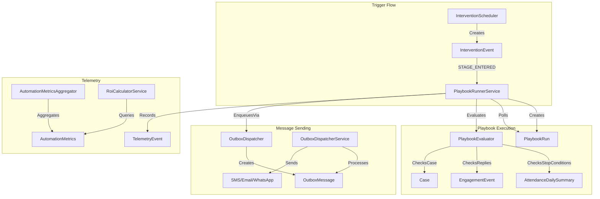

# Epic C: Hybrid Multi-touch Playbooks Implementation Plan

## Summary

Epic C extends the Attendance Intervention Orchestrator (Epic B) with automated multi-channel follow-up sequences. When a student enters an intervention stage, a playbook can automatically send a sequence of messages (SMS on D+1, WhatsApp on D+3, Email on D+7) until stop conditions are met (attendance improvement, guardian reply, case closed).

---

## Current State Assessment

### Existing Infrastructure to Leverage

- **Intervention System (Epic B):** [`InterventionEvent`](src/Shared/AnseoConnect.Data/Entities/InterventionEvent.cs), [`InterventionStage`](src/Shared/AnseoConnect.Data/Entities/InterventionStage.cs), [`StudentInterventionInstance`](src/Shared/AnseoConnect.Data/Entities/StudentInterventionInstance.cs)
- **Outbox Pattern:** [`OutboxMessage`](src/Shared/AnseoConnect.Data/Entities/OutboxMessage.cs), [`OutboxDispatcherService`](src/Services/AnseoConnect.Comms/Services/OutboxDispatcherService.cs) - reliable, idempotent message dispatch
- **Engagement Tracking:** [`EngagementEvent`](src/Shared/AnseoConnect.Data/Entities/EngagementEvent.cs) for reply/open detection
- **Translation:** `ITranslationService` and `TranslationCache` for guardian language preferences
- **Contact Preferences:** `ContactPreference`, `ConsentRecord` for channel consent checks

### Key Integration Points

- `InterventionScheduler` creates `InterventionEvent` with `EventType="STAGE_ENTERED"` - this triggers playbooks
- `OutboxDispatcher.EnqueueAsync()` - use existing pattern for scheduled sends
- `EngagementEvent.EventType="REPLIED"` - stop condition detection

---

## C1. Playbook Engine (Multi-channel Sequences)

### C1.S1 - Sequence Definition and Runner

#### New Entities

**Location:** `src/Shared/AnseoConnect.Data/Entities/`

```csharp
// PlaybookDefinition - reusable template for a multi-touch sequence
public sealed class PlaybookDefinition : ITenantScoped {
    Guid PlaybookId;
    Guid TenantId;
    Guid? SchoolId; // null = tenant-wide
    string Name;
    string Description;
    string TriggerStageType; // e.g., "LETTER_1" - which stage activates this playbook
    bool IsActive;
    string StopConditionsJson; // ["ATTENDANCE_IMPROVED", "GUARDIAN_REPLIED", "CASE_CLOSED"]
    string EscalationConditionsJson; // conditions that create a meeting task
    int EscalationAfterDays; // days of non-response before escalating
    DateTimeOffset CreatedAtUtc;
    DateTimeOffset UpdatedAtUtc;
}

// PlaybookStep - individual message in a sequence
public sealed class PlaybookStep : ITenantScoped {
    Guid StepId;
    Guid TenantId;
    Guid PlaybookId;
    int Order; // sequence order
    int OffsetDays; // days after trigger (D+1, D+3, etc.)
    string Channel; // SMS, EMAIL, WHATSAPP, IN_APP
    Guid? MessageTemplateId; // template to use
    string? FallbackChannel; // if primary fails
    bool SkipIfPreviousReplied; // optimization
}

// PlaybookRun - active execution for a student/intervention
public sealed class PlaybookRun : SchoolEntity {
    Guid RunId;
    Guid PlaybookId;
    Guid InstanceId; // StudentInterventionInstance
    Guid StudentId;
    Guid? GuardianId; // which guardian this run targets
    string Status; // ACTIVE, STOPPED, COMPLETED, ESCALATED
    DateTimeOffset TriggeredAtUtc; // when the triggering stage event occurred
    DateTimeOffset? StoppedAtUtc;
    string? StopReason; // "ATTENDANCE_IMPROVED", "GUARDIAN_REPLIED", etc.
    int CurrentStepOrder; // which step we're on
    DateTimeOffset? NextStepScheduledAtUtc;
}

// PlaybookExecutionLog - audit log of step executions
public sealed class PlaybookExecutionLog : SchoolEntity {
    Guid LogId;
    Guid RunId;
    Guid StepId;
    string Channel;
    Guid? OutboxMessageId; // link to outbox for traceability
    string IdempotencyKey; // ensures no duplicate sends
    string Status; // SCHEDULED, SENT, SKIPPED, FAILED
    string? SkipReason; // "STOP_CONDITION_MET", "CONSENT_MISSING", etc.
    DateTimeOffset ScheduledForUtc;
    DateTimeOffset? ExecutedAtUtc;
}
```

#### PlaybookRunnerService

**Location:** `src/Services/AnseoConnect.Workflow/Services/PlaybookRunnerService.cs`

```csharp
public sealed class PlaybookRunnerService : BackgroundService {
    // Poll interval: 60 seconds
    // 1. Check for new InterventionEvents with EventType="STAGE_ENTERED"
    //    that match a PlaybookDefinition.TriggerStageType
    // 2. Create PlaybookRun for each guardian of the student
    // 3. Process scheduled steps: find PlaybookRuns where NextStepScheduledAtUtc <= now
    // 4. For each due step:
    //    a. Check stop conditions (attendance improved, reply received, case closed)
    //    b. If stop condition met -> mark run STOPPED
    //    c. If not stopped -> check consent, enqueue message via OutboxDispatcher
    //    d. Schedule next step or mark COMPLETED
    // 5. Check escalation conditions for non-responding runs
}
```

**Idempotency Key Format:** `playbook:{runId}:{stepId}:{guardianId}`

#### PlaybookEvaluator

**Location:** `src/Services/AnseoConnect.Workflow/Services/PlaybookEvaluator.cs`

```csharp
public sealed class PlaybookEvaluator {
    // Check stop conditions
    Task<StopConditionResult> EvaluateStopConditionsAsync(PlaybookRun run);
    
    // Check if escalation is needed
    Task<bool> ShouldEscalateAsync(PlaybookRun run, PlaybookDefinition playbook);
    
    // Stop conditions:
    // - ATTENDANCE_IMPROVED: Check AttendanceDailySummary for improvement
    // - GUARDIAN_REPLIED: Check EngagementEvent for REPLIED type
    // - CASE_CLOSED: Check Case.Status
    // - EXEMPTION_FLAG: Check student exemptions
}
```

#### InterventionEvent Subscription

Modify [`InterventionScheduler`](src/Services/AnseoConnect.Workflow/Services/InterventionScheduler.cs) to publish a message/event when `STAGE_ENTERED` events are created, or have `PlaybookRunnerService` poll for new events.

---

## C2. Operational Telemetry (ROI)

### C2.S1 - Automation Metrics

#### New Entities

**Location:** `src/Shared/AnseoConnect.Data/Entities/`

```csharp
// TelemetryEvent - individual automation events for ROI tracking
public sealed class TelemetryEvent : SchoolEntity {
    Guid TelemetryEventId;
    string EventType; // PLAYBOOK_STARTED, STEP_SENT, PLAYBOOK_STOPPED, ATTENDANCE_IMPROVED
    Guid? PlaybookRunId;
    Guid? StudentId;
    string? MetadataJson; // channel used, time saved estimate, etc.
    DateTimeOffset OccurredAtUtc;
}

// AutomationMetrics - aggregated daily metrics per school
public sealed class AutomationMetrics : SchoolEntity {
    Guid MetricsId;
    DateOnly Date;
    int PlaybooksStarted;
    int StepsScheduled;
    int StepsSent;
    int PlaybooksStoppedByReply;
    int PlaybooksStoppedByImprovement;
    int Escalations;
    decimal EstimatedMinutesSaved; // based on configurable estimate per touch
    decimal AttendanceImprovementDelta; // avg % change after playbooks
}
```

#### RoiCalculatorService

**Location:** `src/Services/AnseoConnect.Workflow/Services/RoiCalculatorService.cs`

```csharp
public sealed class RoiCalculatorService {
    // Configurable: MinutesPerManualTouch (default: 5 minutes)
    // Computes: touches_sent * MinutesPerManualTouch = minutes_saved
    
    Task<RoiSummary> CalculateAsync(Guid schoolId, DateOnly from, DateOnly to);
    Task<RoiReport> GenerateExportAsync(Guid schoolId, DateOnly from, DateOnly to);
}

public sealed record RoiSummary(
    int TotalPlaybooksRun,
    int TotalTouchesSent,
    decimal EstimatedHoursSaved,
    int StudentsReachedByAutomation,
    int StudentsImprovedAfterPlaybook,
    decimal AvgAttendanceChangePercent);
```

#### AutomationMetricsAggregator

**Location:** `src/Services/AnseoConnect.Workflow/Services/AutomationMetricsAggregator.cs`

Background job that runs daily to aggregate `TelemetryEvent` into `AutomationMetrics`.

---

## Database Migration

**File:** `src/Shared/AnseoConnect.Data/Migrations/[timestamp]_EpicC_HybridPlaybooks.cs`

Create tables with indexes:

- `PlaybookDefinitions` - IX_PlaybookDefinitions_TriggerStage
- `PlaybookSteps` - IX_PlaybookSteps_Playbook_Order
- `PlaybookRuns` - IX_PlaybookRuns_Status_NextStep, IX_PlaybookRuns_Instance
- `PlaybookExecutionLogs` - IX_PlaybookExecutionLogs_Run, IX_PlaybookExecutionLogs_Idempotency
- `TelemetryEvents` - IX_TelemetryEvents_Date
- `AutomationMetrics` - IX_AutomationMetrics_Date (unique per school/date)

---

## API Endpoints

**Location:** `src/Services/AnseoConnect.ApiGateway/Controllers/PlaybooksController.cs`

```
// Playbook Definitions
GET    /api/playbooks                          # List playbook definitions
POST   /api/playbooks                          # Create playbook definition
GET    /api/playbooks/{id}                     # Get playbook with steps
PUT    /api/playbooks/{id}                     # Update playbook
DELETE /api/playbooks/{id}                     # Deactivate playbook

// Playbook Steps
POST   /api/playbooks/{id}/steps               # Add step
PUT    /api/playbooks/{id}/steps/{stepId}      # Update step
DELETE /api/playbooks/{id}/steps/{stepId}      # Remove step

// Active Runs
GET    /api/playbooks/runs                     # List active runs (filterable)
GET    /api/playbooks/runs/{runId}             # Run details with logs
POST   /api/playbooks/runs/{runId}/stop        # Manually stop a run

// ROI/Telemetry
GET    /api/telemetry/roi                      # ROI summary
GET    /api/telemetry/roi/export               # Download ROI report (XLSX)
GET    /api/telemetry/metrics                  # Daily metrics
```

---

## UI Pages

**Location:** `src/Web/AnseoConnect.Web/Pages/`

### PlaybookDesigner.razor

- List playbooks with status (active/inactive)
- Create/edit playbook: name, trigger stage, stop conditions
- Step editor: drag-drop reorder, configure channel/offset/template
- Preview: visualize sequence timeline

### PlaybookMonitor.razor

- List active playbook runs
- Filter by school, student, playbook, status
- View run details: which steps sent, stop reason
- Manual stop action

### RoiDashboard.razor

- Time period selector
- KPI cards: hours saved, touches sent, students reached
- DxChart: daily metrics trend
- Attendance impact: before/after comparison
- Export button for ROI report

---

## Data Flow Diagram



---

## Key Implementation Details

### Idempotency

- Each `PlaybookExecutionLog` has an idempotency key: `playbook:{runId}:{stepId}:{guardianId}`
- The `OutboxDispatcher` already deduplicates by idempotency key per tenant
- This ensures no duplicate sends even if `PlaybookRunnerService` processes the same step twice

### Stop Condition Evaluation Order

1. Check case status (if closed, stop immediately)
2. Check exemption flags on student
3. Check for guardian reply (any REPLIED event after playbook started)
4. Check attendance improvement (compare current % to baseline at playbook start)

### Escalation Logic

- If playbook has been running for `EscalationAfterDays` with no stop condition met
- And at least one step has been attempted
- Create a `WorkTask` for staff follow-up (meeting scheduling)

### Multi-Guardian Handling

- Create separate `PlaybookRun` per guardian for the student
- Each guardian gets their own message sequence
- Stop condition (e.g., reply from any guardian) can optionally stop all runs for that student

---

## Files to Create

**Entities:**

- `src/Shared/AnseoConnect.Data/Entities/PlaybookDefinition.cs`
- `src/Shared/AnseoConnect.Data/Entities/PlaybookStep.cs`
- `src/Shared/AnseoConnect.Data/Entities/PlaybookRun.cs`
- `src/Shared/AnseoConnect.Data/Entities/PlaybookExecutionLog.cs`
- `src/Shared/AnseoConnect.Data/Entities/TelemetryEvent.cs`
- `src/Shared/AnseoConnect.Data/Entities/AutomationMetrics.cs`

**Services:**

- `src/Services/AnseoConnect.Workflow/Services/PlaybookRunnerService.cs`
- `src/Services/AnseoConnect.Workflow/Services/PlaybookEvaluator.cs`
- `src/Services/AnseoConnect.Workflow/Services/RoiCalculatorService.cs`
- `src/Services/AnseoConnect.Workflow/Services/AutomationMetricsAggregator.cs`

**API:**

- `src/Services/AnseoConnect.ApiGateway/Controllers/PlaybooksController.cs`
- `src/Services/AnseoConnect.ApiGateway/Controllers/TelemetryController.cs`
- `src/UI/AnseoConnect.Client/PlaybooksClient.cs`

**UI:**

- `src/Web/AnseoConnect.Web/Pages/PlaybookDesigner.razor`
- `src/Web/AnseoConnect.Web/Pages/PlaybookMonitor.razor`
- `src/Web/AnseoConnect.Web/Pages/RoiDashboard.razor`

**Migration:**

- `src/Shared/AnseoConnect.Data/Migrations/[timestamp]_EpicC_HybridPlaybooks.cs`

---

## Definition of Done

- Unit tests for `PlaybookEvaluator` stop condition logic
- Integration tests for `PlaybookRunnerService` idempotency
- All playbook actions logged in `PlaybookExecutionLog` and `TelemetryEvent`
- Background jobs use distributed lock (follow `InterventionScheduler` pattern)
- UI pages include empty/error/loading states
- All API endpoints accept `CancellationToken`
- RBAC: playbook management requires admin role, viewing runs requires case access