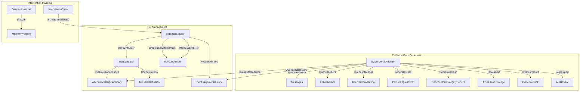

# Epic D: MTSS Attendance Layer + Evidence Packs Implementation Plan

## Summary

Epic D introduces a formal Multi-Tiered System of Supports (MTSS) framework for attendance interventions, plus production-grade evidence packs for inspections, audits, and external agency handoffs. This builds on the existing intervention infrastructure from Epic B and integrates with playbooks from Epic C.

---

## Current State Assessment

### Existing Infrastructure to Leverage

- **Case Entity:** [`src/Shared/AnseoConnect.Data/Entities/Case.cs`](src/Shared/AnseoConnect.Data/Entities/Case.cs) - Has basic `Tier` int field (1/2/3)
- **CaseService:** [`src/Services/AnseoConnect.Workflow/Services/CaseService.cs`](src/Services/AnseoConnect.Workflow/Services/CaseService.cs) - `EscalateToTier2Async()` and `EscalateToTier3Async()` methods
- **InterventionRuleSet/Stage:** [`InterventionStage.cs`](src/Shared/AnseoConnect.Data/Entities/InterventionStage.cs) - Stage ladder (Letter1, Letter2, Meeting, Escalation)
- **EvidencePack Entity:** [`EvidencePack.cs`](src/Shared/AnseoConnect.Data/Entities/EvidencePack.cs) - Basic entity linked to Case
- **EvidencePackService:** [`EvidencePackService.cs`](src/Services/AnseoConnect.Workflow/Services/EvidencePackService.cs) - Generates simple PDF with QuestPDF
- **TierController:** [`TierController.cs`](src/Services/AnseoConnect.Workflow/Controllers/TierController.cs) - Tier 3 escalation endpoint
- **LetterArtifact:** [`LetterArtifact.cs`](src/Shared/AnseoConnect.Data/Entities/LetterArtifact.cs) - Intervention stage letter artifacts with integrity hashes

### Gaps to Address

- No formal MTSS tier definitions (currently just an int field on Case)
- No intervention library mapped to tiers
- No entry/exit/escalation criteria configuration
- No tier assignment history or rationale tracking
- Evidence packs missing: date range selection, scope options, attendance charts, integrity verification, zip export, audit logging

---

## D1. MTSS Tier Model and Intervention Library

### D1.S1 - Tier Configuration and Mapping

#### New Entities

**Location:** `src/Shared/AnseoConnect.Data/Entities/`

```csharp
// MtssTierDefinition - configurable tier definitions per tenant
public sealed class MtssTierDefinition : ITenantScoped {
    Guid TierDefinitionId;
    Guid TenantId;
    int TierNumber; // 1, 2, 3
    string Name; // "Universal", "Targeted", "Intensive"
    string Description;
    string EntryCriteriaJson; // conditions that place a student in this tier
    string ExitCriteriaJson; // conditions that move student down a tier
    string EscalationCriteriaJson; // conditions that move student up
    int ReviewIntervalDays; // how often to re-evaluate tier placement
    string RequiredArtifactsJson; // what must be documented at this tier
    string RecommendedInterventionsJson; // intervention IDs mapped to this tier
    bool IsActive;
}

// MtssIntervention - library of available interventions
public sealed class MtssIntervention : ITenantScoped {
    Guid InterventionId;
    Guid TenantId;
    string Name;
    string Description;
    string Category; // COMMUNICATION, MEETING, SUPPORT_PLAN, REFERRAL
    int[] ApplicableTiers; // [1,2] or [2,3]
    string EvidenceRequirementsJson;
    bool RequiresParentConsent;
    int? TypicalDurationDays;
}

// TierAssignment - current tier assignment for a student/case
public sealed class TierAssignment : SchoolEntity {
    Guid AssignmentId;
    Guid StudentId;
    Guid CaseId;
    int TierNumber;
    Guid TierDefinitionId;
    string AssignmentReason; // AUTO_ESCALATED, MANUAL, RULE_TRIGGERED
    string RationaleJson; // explains why this tier was assigned
    DateTimeOffset AssignedAtUtc;
    DateTimeOffset? NextReviewAtUtc;
    Guid? AssignedByUserId; // null if auto-assigned
}

// TierAssignmentHistory - audit trail of tier changes
public sealed class TierAssignmentHistory : SchoolEntity {
    Guid HistoryId;
    Guid AssignmentId;
    Guid StudentId;
    Guid CaseId;
    int FromTier;
    int ToTier;
    string ChangeType; // ENTRY, ESCALATION, DE_ESCALATION, EXIT
    string ChangeReason;
    string RationaleJson;
    Guid? ChangedByUserId;
    DateTimeOffset ChangedAtUtc;
}

// CaseIntervention - interventions applied to a case
public sealed class CaseIntervention : SchoolEntity {
    Guid CaseInterventionId;
    Guid CaseId;
    Guid InterventionId;
    int TierWhenApplied;
    string Status; // PLANNED, ACTIVE, COMPLETED, CANCELLED
    DateTimeOffset StartedAtUtc;
    DateTimeOffset? CompletedAtUtc;
    string OutcomeNotes;
    Guid? AssignedToUserId;
}
```

#### MtssTierService

**Location:** `src/Services/AnseoConnect.Workflow/Services/MtssTierService.cs`

```csharp
public sealed class MtssTierService {
    // Evaluate tier placement for a student based on attendance data
    Task<TierEvaluationResult> EvaluateTierAsync(Guid studentId, Guid caseId);
    
    // Assign/change tier with rationale
    Task<TierAssignment> AssignTierAsync(Guid caseId, int tierNumber, string reason, string rationaleJson);
    
    // Get tier history for a case
    Task<List<TierAssignmentHistory>> GetHistoryAsync(Guid caseId);
    
    // Get current tier with rationale explanation
    Task<TierAssignmentWithRationale> GetCurrentTierAsync(Guid caseId);
    
    // Map intervention stages to tiers
    Task SyncStageToTierMappingAsync(Guid instanceId, Guid stageId);
}
```

#### TierEvaluator

**Location:** `src/Services/AnseoConnect.Workflow/Services/TierEvaluator.cs`

```csharp
public sealed class TierEvaluator {
    // Evaluate entry criteria (attendance % thresholds, absence counts, etc.)
    Task<bool> MeetsEntryCriteriaAsync(Guid studentId, MtssTierDefinition tier);
    
    // Evaluate exit criteria (improved attendance, support plan success)
    Task<bool> MeetsExitCriteriaAsync(Guid studentId, TierAssignment current);
    
    // Evaluate escalation criteria (continued decline, non-response)
    Task<bool> ShouldEscalateAsync(Guid studentId, TierAssignment current);
    
    // Build rationale explanation from evaluation data
    string BuildRationale(TierEvaluationResult result);
}
```

#### Integration with Existing Systems

- Modify [`CaseService.EscalateToTier2Async()`](src/Services/AnseoConnect.Workflow/Services/CaseService.cs) to create `TierAssignment` and history records
- Subscribe to `InterventionEvent` (STAGE_ENTERED) to auto-map stages to tier progression
- Add tier review scheduled job that re-evaluates tier placements based on `NextReviewAtUtc`

---

## D2. Evidence Packs (Final Product)

### D2.S1 - One-click Evidence Pack Builder

#### Enhanced EvidencePack Entity

Extend existing [`EvidencePack.cs`](src/Shared/AnseoConnect.Data/Entities/EvidencePack.cs):

```csharp
public sealed class EvidencePack : SchoolEntity {
    Guid EvidencePackId;
    Guid CaseId;
    Guid StudentId;
    
    // Scope configuration
    DateOnly DateRangeStart;
    DateOnly DateRangeEnd;
    string IncludedSectionsJson; // ["ATTENDANCE", "COMMUNICATIONS", "LETTERS", "MEETINGS", "TASKS"]
    
    // Outputs
    string Format; // "PDF", "PDF_WITH_ZIP"
    string StoragePath; // PDF blob path
    string? ZipStoragePath; // ZIP blob path (raw artifacts)
    string IndexJson; // table of contents with page/artifact references
    
    // Integrity
    string ContentHash; // SHA-256 of the PDF
    string ManifestHash; // SHA-256 of the manifest/index
    
    // Audit
    Guid GeneratedByUserId;
    DateTimeOffset GeneratedAtUtc;
    string GenerationPurpose; // INSPECTION, AGENCY_REFERRAL, PARENT_REQUEST, ARCHIVE
}
```

#### EvidencePackBuilder Service

**Location:** `src/Services/AnseoConnect.Workflow/Services/EvidencePackBuilder.cs`

```csharp
public sealed class EvidencePackBuilder {
    Task<EvidencePack> BuildAsync(EvidencePackRequest request, CancellationToken ct);
}

public sealed record EvidencePackRequest(
    Guid CaseId,
    DateOnly DateRangeStart,
    DateOnly DateRangeEnd,
    EvidencePackSections IncludeSections,
    string Purpose,
    Guid RequestedByUserId);

[Flags]
public enum EvidencePackSections {
    Attendance = 1,
    Communications = 2,
    Letters = 4,
    Meetings = 8,
    Tasks = 16,
    TierHistory = 32,
    Safeguarding = 64, // restricted
    All = Attendance | Communications | Letters | Meetings | Tasks | TierHistory
}
```

#### PDF Sections to Generate

Each section is permission-gated:

- **Cover Page:** Student info, case summary, date range, generation metadata
- **Attendance Section:** 
  - Summary stats (% attendance, total absences, patterns)
  - Attendance chart (monthly trend via QuestPDF charting)
  - Daily breakdown table
- **Tier History Section:**
  - Current tier assignment with rationale
  - History of tier changes with dates and reasons
  - Interventions applied at each tier
- **Communications Section:**
  - Transcript excerpts (redacted if needed)
  - Delivery status summary per guardian
  - Channel breakdown
- **Letters Section:**
  - Index of letters sent with stage reference
  - Each letter artifact embedded or referenced
- **Meetings Section:**
  - Meeting dates, attendees, outcomes
  - Follow-up tasks created
- **Tasks Section:**
  - Checklist items completed
  - Open/overdue tasks
- **Index/Table of Contents:**
  - Page numbers for each section
  - Artifact references with hashes

#### Integrity and Audit

```csharp
public sealed class EvidencePackIntegrityService {
    // Compute SHA-256 hash of generated PDF
    string ComputeContentHash(byte[] pdfBytes);
    
    // Verify an existing pack's integrity
    Task<bool> VerifyIntegrityAsync(Guid evidencePackId);
    
    // Create audit log entry for evidence export
    Task LogExportAsync(Guid evidencePackId, Guid userId, string purpose);
}
```

---

## Database Migration

**File:** `src/Shared/AnseoConnect.Data/Migrations/[timestamp]_EpicD_MtssEvidencePacks.cs`

Create tables with indexes:

- `MtssTierDefinitions` - IX_MtssTierDefinitions_Tenant_TierNumber
- `MtssInterventions` - IX_MtssInterventions_Tenant_Category
- `TierAssignments` - IX_TierAssignments_Case (unique per case)
- `TierAssignmentHistory` - IX_TierAssignmentHistory_Case_ChangedAt
- `CaseInterventions` - IX_CaseInterventions_Case_Status
- Alter `EvidencePacks` - Add new columns, IX_EvidencePacks_Case_GeneratedAt

---

## API Endpoints

**Location:** `src/Services/AnseoConnect.ApiGateway/Controllers/`

### TierController (extend existing)

```
GET    /api/tiers/definitions                    # List tier definitions
POST   /api/tiers/definitions                    # Create/update tier definition
GET    /api/cases/{caseId}/tier                  # Get current tier with rationale
POST   /api/cases/{caseId}/tier                  # Manually assign tier
GET    /api/cases/{caseId}/tier/history          # Get tier change history
POST   /api/cases/{caseId}/tier/evaluate         # Preview tier evaluation
```

### InterventionsController (extend existing)

```
GET    /api/interventions                         # List intervention library
POST   /api/interventions                         # Create intervention
GET    /api/cases/{caseId}/interventions          # List case interventions
POST   /api/cases/{caseId}/interventions          # Apply intervention to case
PUT    /api/cases/{caseId}/interventions/{id}     # Update intervention status
```

### EvidenceController (new)

```
POST   /api/cases/{caseId}/evidence               # Generate evidence pack
GET    /api/cases/{caseId}/evidence               # List evidence packs for case
GET    /api/cases/{caseId}/evidence/{id}          # Get evidence pack metadata
GET    /api/cases/{caseId}/evidence/{id}/download # Download PDF
GET    /api/cases/{caseId}/evidence/{id}/zip      # Download ZIP bundle
POST   /api/cases/{caseId}/evidence/{id}/verify   # Verify integrity
```

---

## UI Pages

**Location:** `src/Web/AnseoConnect.Web/Pages/`

### TierConfiguration.razor

- List/edit MTSS tier definitions
- Configure entry/exit/escalation criteria per tier
- Map interventions to tiers
- Preview criteria evaluation

### StudentTierView.razor (component)

- Show current tier badge with rationale tooltip
- Tier history timeline
- Active interventions list
- Quick actions: evaluate tier, apply intervention

### EvidencePackGenerator.razor

- Select case/student
- Date range picker (DxDateRangePicker)
- Section checkboxes (attendance, comms, letters, meetings, tasks, tier history)
- Purpose dropdown (Inspection, Agency Referral, Parent Request, Archive)
- Preview button (shows what will be included)
- Generate button
- Progress indicator during generation

### EvidencePackViewer.razor

- List evidence packs for a case
- Metadata display: date range, sections, hash, generated by
- Download buttons (PDF, ZIP)
- Verify integrity button
- Regenerate option (creates new pack, keeps old)

---

## Data Flow Diagram



---

## Key Implementation Details

### Tier Evaluation Criteria Schema

```json
{
  "attendancePercentBelow": 90,
  "absenceCountAbove": 10,
  "consecutiveAbsencesAbove": 3,
  "previousTierDaysMin": 30,
  "requiresStageCompletion": ["LETTER_1", "LETTER_2"],
  "excludeIfExemption": true
}
```

### Evidence Pack Manifest Schema

```json
{
  "generatedAt": "2026-01-13T10:00:00Z",
  "caseId": "...",
  "studentId": "...",
  "dateRange": { "start": "2025-09-01", "end": "2026-01-13" },
  "sections": [
    { "name": "Attendance", "page": 2, "artifactCount": 0 },
    { "name": "Communications", "page": 5, "artifactCount": 12 },
    { "name": "Letters", "page": 15, "artifactCount": 2, "artifacts": ["...hash1", "...hash2"] }
  ],
  "contentHash": "sha256:...",
  "manifestHash": "sha256:..."
}
```

### Permission Gates

- **View tier assignments:** Requires case access
- **Change tier manually:** Requires `TierManagement` permission
- **Generate evidence pack:** Requires case access + `EvidenceExport` permission
- **Include safeguarding section:** Requires `SafeguardingAccess` permission
- **Verify integrity:** Any authenticated user with case access

---

## Files to Create

**Entities:**

- `src/Shared/AnseoConnect.Data/Entities/MtssTierDefinition.cs`
- `src/Shared/AnseoConnect.Data/Entities/MtssIntervention.cs`
- `src/Shared/AnseoConnect.Data/Entities/TierAssignment.cs`
- `src/Shared/AnseoConnect.Data/Entities/TierAssignmentHistory.cs`
- `src/Shared/AnseoConnect.Data/Entities/CaseIntervention.cs`

**Services:**

- `src/Services/AnseoConnect.Workflow/Services/MtssTierService.cs`
- `src/Services/AnseoConnect.Workflow/Services/TierEvaluator.cs`
- `src/Services/AnseoConnect.Workflow/Services/EvidencePackBuilder.cs`
- `src/Services/AnseoConnect.Workflow/Services/EvidencePackIntegrityService.cs`

**API:**

- Extend `src/Services/AnseoConnect.Workflow/Controllers/TierController.cs`
- `src/Services/AnseoConnect.ApiGateway/Controllers/EvidenceController.cs`
- `src/UI/AnseoConnect.Client/TierClient.cs`
- `src/UI/AnseoConnect.Client/EvidenceClient.cs`

**UI:**

- `src/Web/AnseoConnect.Web/Pages/TierConfiguration.razor`
- `src/Web/AnseoConnect.Web/Components/StudentTierView.razor`
- `src/Web/AnseoConnect.Web/Pages/EvidencePackGenerator.razor`
- `src/Web/AnseoConnect.Web/Pages/EvidencePackViewer.razor`

**Migration:**

- `src/Shared/AnseoConnect.Data/Migrations/[timestamp]_EpicD_MtssEvidencePacks.cs`

---

## Definition of Done

- Unit tests for `TierEvaluator` criteria evaluation
- Unit tests for `EvidencePackIntegrityService` hash computation and verification
- Integration tests for `EvidencePackBuilder` producing valid PDF
- Tier changes recorded in `TierAssignmentHistory` with full rationale
- Evidence exports logged in audit system
- Background tier review job uses distributed lock pattern
- UI pages include empty/error/loading states
- All API endpoints accept `CancellationToken`
- RBAC: tier management requires elevated permission, evidence export is audited
- Evidence pack PDF verifiable via stored hash