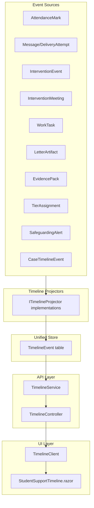

# Epic E - Student Support Timeline Implementation

## Current State Analysis

The codebase already has fragmented timeline infrastructure:

- [CaseTimelineEvent.cs](src/Shared/AnseoConnect.Data/Entities/CaseTimelineEvent.cs) - case-scoped events only (notes, escalations)
- [InterventionEvent.cs](src/Shared/AnseoConnect.Data/Entities/InterventionEvent.cs) - intervention stage changes
- [EngagementEvent.cs](src/Shared/AnseoConnect.Data/Entities/EngagementEvent.cs) - message delivery/engagement tracking
- [Timeline.razor](src/UI/AnseoConnect.UI.Shared/Components/Timeline.razor) - simple dual-mode component (case OR message events)

The current `StudentDetail.razor` page shows data in separate tabs (Guardians, Cases, Messages) with no unified view.

## Architecture Approach



## Data Model

### New Entity: `TimelineEvent`

Location: [src/Shared/AnseoConnect.Data/Entities/TimelineEvent.cs](src/Shared/AnseoConnect.Data/Entities/TimelineEvent.cs) (new file)

```csharp
public sealed class TimelineEvent : SchoolEntity
{
    public Guid EventId { get; set; }
    public Guid StudentId { get; set; }
    public Guid? CaseId { get; set; }
    
    public string EventType { get; set; } = string.Empty;
    public string Category { get; set; } = string.Empty; // ATTENDANCE, COMMS, INTERVENTION, MEETING, TASK, EVIDENCE, TIER, SAFEGUARDING
    public string SourceEntityType { get; set; } = string.Empty;
    public Guid SourceEntityId { get; set; }
    
    public DateTimeOffset OccurredAtUtc { get; set; }
    public string? ActorId { get; set; }
    public string? ActorName { get; set; }
    
    public string? Title { get; set; }
    public string? Summary { get; set; }
    public string? MetadataJson { get; set; }
    
    public string VisibilityScope { get; set; } = "STANDARD"; // STANDARD, SAFEGUARDING, ADMIN_ONLY
    public string? SearchableText { get; set; } // Denormalized for full-text search
    
    public DateTimeOffset CreatedAtUtc { get; set; } = DateTimeOffset.UtcNow;
}
```

Key design decisions:

- **Append-only**: No updates/deletes, events are immutable
- **Source reference**: `SourceEntityType` + `SourceEntityId` links back to original entity
- **RBAC via VisibilityScope**: Filter by user role permissions
- **SearchableText**: Denormalized field for efficient full-text search

### Indexes Required

```sql
-- Primary query: student timeline ordered by date
IX_TimelineEvents_StudentId_OccurredAtUtc (TenantId, SchoolId, StudentId, OccurredAtUtc DESC)

-- Case-filtered timeline
IX_TimelineEvents_CaseId_OccurredAtUtc (TenantId, CaseId, OccurredAtUtc DESC)

-- Category filtering
IX_TimelineEvents_Category (TenantId, SchoolId, StudentId, Category, OccurredAtUtc DESC)

-- Full-text search
FULLTEXT INDEX on SearchableText
```

## Implementation Tasks

### Task 1: Data Model and Migration

- Create `TimelineEvent` entity
- Add EF Core configuration in `AnseoConnectDbContext`
- Create migration with indexes

### Task 2: Timeline Projector Framework

Location: [src/Services/AnseoConnect.Workflow/Timeline/](src/Services/AnseoConnect.Workflow/Timeline/) (new folder)

Create:

- `ITimelineProjector` interface
- Base projector implementation
- Individual projectors for each source:
  - `AttendanceTimelineProjector`
  - `MessageTimelineProjector`
  - `InterventionTimelineProjector`
  - `MeetingTimelineProjector`
  - `TaskTimelineProjector`
  - `LetterTimelineProjector`
  - `EvidenceTimelineProjector`
  - `TierTimelineProjector`
  - `SafeguardingTimelineProjector`
  - `CaseEventTimelineProjector`

Projection triggers:

- Wire into existing consumers (e.g., `MessageEventConsumer`, `AttendanceMarksIngestedConsumer`)
- Add projection calls to existing services when entities are created/updated

### Task 3: Timeline Service and API

**Service** - [src/Services/AnseoConnect.Workflow/Services/TimelineService.cs](src/Services/AnseoConnect.Workflow/Services/TimelineService.cs) (new file)

```csharp
public interface ITimelineService
{
    Task<PagedResult<TimelineEventDto>> GetStudentTimelineAsync(
        Guid studentId, 
        TimelineFilter filter, 
        CancellationToken ct);
    
    Task<PagedResult<TimelineEventDto>> SearchTimelineAsync(
        Guid studentId, 
        string searchTerm, 
        CancellationToken ct);
    
    Task<Stream> ExportTimelineAsync(
        Guid studentId, 
        ExportOptions options, 
        CancellationToken ct);
}
```

**Controller** - [src/Web/AnseoConnect.Web/Controllers/TimelineController.cs](src/Web/AnseoConnect.Web/Controllers/TimelineController.cs) (new file)

Endpoints:

- `GET /api/students/{studentId}/timeline` - paginated timeline with filters
- `GET /api/students/{studentId}/timeline/search?q=` - full-text search
- `GET /api/students/{studentId}/timeline/export` - PDF/Excel export

### Task 4: DTOs and Client

**DTOs** - Add to [src/Shared/AnseoConnect.Contracts/DTOs/TimelineDto.cs](src/Shared/AnseoConnect.Contracts/DTOs/TimelineDto.cs) (new file)

```csharp
public sealed record TimelineEventDto(
    Guid EventId,
    Guid StudentId,
    Guid? CaseId,
    string EventType,
    string Category,
    DateTimeOffset OccurredAtUtc,
    string? ActorName,
    string? Title,
    string? Summary,
    string? MetadataJson,
    string VisibilityScope);

public sealed record TimelineFilter(
    DateTimeOffset? FromUtc,
    DateTimeOffset? ToUtc,
    IReadOnlyList<string>? Categories,
    IReadOnlyList<string>? EventTypes,
    Guid? CaseId,
    int Skip = 0,
    int Take = 50);

public sealed record ExportOptions(
    DateTimeOffset? FromUtc,
    DateTimeOffset? ToUtc,
    IReadOnlyList<string>? Categories,
    bool IncludeRedacted = false,
    string Format = "PDF");
```

**Client** - [src/UI/AnseoConnect.Client/TimelineClient.cs](src/UI/AnseoConnect.Client/TimelineClient.cs) (new file)

### Task 5: UI Components

**Student Support Timeline Page** - [src/Web/AnseoConnect.Web/Pages/StudentSupportTimeline.razor](src/Web/AnseoConnect.Web/Pages/StudentSupportTimeline.razor) (new file)

Features:

- Unified chronological view of all student events
- Filter panel: date range, category checkboxes, search box
- Visual event cards with icons per category
- Expand/collapse for event details
- Quick navigation to source entity (case, message, meeting, etc.)
- Export button with options dialog

**Enhanced Timeline Component** - Refactor [src/UI/AnseoConnect.UI.Shared/Components/Timeline.razor](src/UI/AnseoConnect.UI.Shared/Components/Timeline.razor)

Replace grid-based display with:

- Visual timeline with vertical connector line
- Category-colored event cards
- Relative timestamps (e.g., "2 hours ago")
- Lazy loading / infinite scroll

### Task 6: RBAC Integration

- Add permission: `VIEW_SAFEGUARDING_TIMELINE` for safeguarding events
- Modify `TimelineService` to filter by user permissions
- Apply `VisibilityScope` filtering in queries

### Task 7: Backfill Existing Data

Create one-time migration job to project existing records into `TimelineEvents`:

- Run projectors against historical data
- Handle in batches with progress tracking
- Idempotent (can re-run safely)

## File Changes Summary

| Location | Action | Description |

|----------|--------|-------------|

| `src/Shared/AnseoConnect.Data/Entities/TimelineEvent.cs` | Create | New entity |

| `src/Shared/AnseoConnect.Data/AnseoConnectDbContext.cs` | Modify | Add DbSet and configuration |

| `src/Shared/AnseoConnect.Data/Migrations/` | Create | New migration |

| `src/Services/AnseoConnect.Workflow/Timeline/` | Create | Projector framework (10+ files) |

| `src/Services/AnseoConnect.Workflow/Services/TimelineService.cs` | Create | Business logic |

| `src/Shared/AnseoConnect.Contracts/DTOs/TimelineDto.cs` | Create | DTOs |

| `src/UI/AnseoConnect.Client/TimelineClient.cs` | Create | API client |

| `src/Web/AnseoConnect.Web/Controllers/TimelineController.cs` | Create | API endpoints |

| `src/Web/AnseoConnect.Web/Pages/StudentSupportTimeline.razor` | Create | Main UI page |

| `src/UI/AnseoConnect.UI.Shared/Components/Timeline.razor` | Modify | Enhanced component |

| `src/Web/AnseoConnect.Web/Pages/StudentDetail.razor` | Modify | Add timeline tab/link |

## Dependencies

Epic E depends on:

- **Epic G (RBAC)**: Permission model for safeguarding visibility filtering
- **Epic B (Interventions)**: Intervention events to project
- **Epic A (Comms)**: Message events to project
- **Epic D (MTSS)**: Tier assignment events to project

If those are partially implemented, projectors for those modules can be stubbed initially and completed as dependencies mature.

## Acceptance Criteria

1. Single screen displays complete chronological story for a student
2. Events from all modules appear in unified timeline
3. Safeguarding events only visible to users with appropriate permissions
4. Full-text search returns relevant events within permissions
5. Export produces PDF with redaction applied based on permissions
6. Timeline updates in near-real-time when new events occur
7. Performance: < 500ms load time for typical student (100+ events)