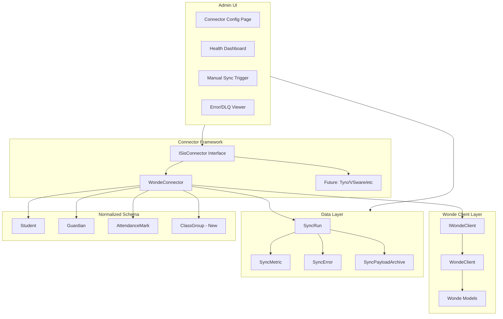

# Epic F - SIS Connector Ecosystem (Wonde Only)

This plan implements Epic F from the gap analysis, focusing exclusively on the Wonde aggregator for Irish schools. It covers:

1. A pluggable connector framework with capability interfaces
2. Hardened Wonde connector with robust sync, delta sync, and full data coverage
3. Health monitoring, alerting, and admin tooling

---

## Current State

The codebase has a **partial Wonde implementation**:

- [WondeClient.cs](src/Services/AnseoConnect.Ingestion.Wonde/Client/WondeClient.cs) - API client with retry, rate limiting, cursor pagination
- [IngestionService.cs](src/Services/AnseoConnect.Ingestion.Wonde/Services/IngestionService.cs) - Orchestrates students, contacts, attendance sync
- [IngestionSyncLog](src/Shared/AnseoConnect.Data/Entities/IngestionSyncLog.cs) - Tracks sync runs (status, counts, errors)
- [School](src/Shared/AnseoConnect.Data/Entities/School.cs) - Has `WondeSchoolId`, `SyncStatus`, `LastSyncUtc`

**Gaps to address:**

- No pluggable `ISisConnector` interface (hardcoded to Wonde)
- Missing classes/timetable sync capabilities
- No proper delta sync (using `updated_after` parameter)
- No admin UI for connector config, health dashboard, manual resync
- No alert thresholds or observability hooks
- No integration tests with recorded fixtures

---

## F1 - Connector Framework + Health Monitoring

### F1.S1 - Pluggable Connectors with Capabilities

Create a connector abstraction layer that allows future SIS integrations while implementing Wonde as the first connector.

**Entities/Interfaces to create:**

```csharp
// ISisConnector with capability discovery
public interface ISisConnector
{
    string ProviderId { get; } // e.g., "WONDE", "TYRO", "VSWARE"
    IReadOnlySet<SisCapability> Capabilities { get; }
    
    Task<SyncRunResult> SyncRosterAsync(Guid schoolId, SyncOptions options, CancellationToken ct);
    Task<SyncRunResult> SyncContactsAsync(Guid schoolId, SyncOptions options, CancellationToken ct);
    Task<SyncRunResult> SyncAttendanceAsync(Guid schoolId, DateOnly date, CancellationToken ct);
    Task<SyncRunResult> SyncClassesAsync(Guid schoolId, SyncOptions options, CancellationToken ct);
    Task<SyncRunResult> SyncTimetableAsync(Guid schoolId, SyncOptions options, CancellationToken ct);
}

public enum SisCapability { RosterSync, ContactsSync, AttendanceSync, ClassesSync, TimetableSync }
```

**Database changes:**

- `SyncRun` table - Individual sync run record (replaces ad-hoc usage of `IngestionSyncLog`)
- `SyncMetric` table - Per-entity metrics (inserted, updated, skipped, errors)
- `SyncError` table - Detailed error records with raw payload refs
- Extend `IngestionSyncLog` with mismatch metrics and alert threshold fields

**Key files to modify:**

- [IngestionSyncLog.cs](src/Shared/AnseoConnect.Data/Entities/IngestionSyncLog.cs) - Add alert threshold fields, mismatch detail
- [IngestionService.cs](src/Services/AnseoConnect.Ingestion.Wonde/Services/IngestionService.cs) - Refactor to implement `ISisConnector`

**Admin UI (Blazor pages in UI.Shared):**

- Connector configuration screen per school (enable/disable, API key management)
- Health dashboard showing last sync times, success rates, error counts
- Manual resync trigger with date picker
- DLQ/error viewer for failed sync records

---

## F2.S1 - Wonde Integration Hardening (Ireland First)

### Task 1: Delta Sync Implementation

Leverage `updatedAfter` parameter properly for incremental syncs:

```csharp
// In WondeClient - already has this, but not used consistently
var studentsResponse = await _wondeClient.GetStudentsAsync(
    school.WondeSchoolId, 
    updatedAfter: school.LastSyncUtc,  // Use last successful sync timestamp
    cancellationToken: ct);
```

Update `IngestionService` to:

- Track last successful sync per entity type (students, contacts, attendance)
- Store sync watermarks in School entity or new `SchoolSyncState` table
- Support full resync vs delta resync modes

### Task 2: Classes and Timetable Sync

Add new endpoints to `IWondeClient`:

```csharp
Task<WondePagedResponse<WondeClass>> GetClassesAsync(string schoolId, DateTimeOffset? updatedAfter, CancellationToken ct);
Task<WondePagedResponse<WondeTimetable>> GetTimetableAsync(string schoolId, CancellationToken ct);
```

Create new entities:

- `ClassGroup` - Maps to Wonde class/group structure
- `StudentClassEnrollment` - Links students to classes
- `TimetablePeriod` - School timetable structure for session determination

### Task 3: Attendance Reason Code Mapping

Implement UK/Ireland reason code taxonomy mapping:

```csharp
// Map Wonde reason codes to normalized internal codes
public interface IReasonCodeMapper
{
    string MapToInternal(string provider, string providerCode);
    string MapToProvider(string provider, string internalCode);
}
```

- Create `ReasonCodeMapping` table with provider-specific mappings
- Use existing [ReasonCode](src/Shared/AnseoConnect.Data/Entities/ReasonCode.cs) entity
- Add admin UI for mapping configuration

### Task 4: Raw Payload Retention

Implement configurable raw payload storage:

```csharp
public class SyncPayloadArchive : SchoolEntity
{
    public Guid ArchiveId { get; set; }
    public Guid SyncRunId { get; set; }
    public string EntityType { get; set; } // "Student", "Contact", "Attendance"
    public string ExternalId { get; set; }
    public string PayloadJson { get; set; }
    public DateTimeOffset CapturedAtUtc { get; set; }
}
```

- Configure retention policies per tenant (GDPR compliance)
- Enable audit trail for data lineage

### Task 5: Health Monitoring and Alerting

Create sync health evaluation:

```csharp
public class ConnectorHealthService
{
    // Evaluate and return health status per school connector
    Task<ConnectorHealth> EvaluateHealthAsync(Guid schoolId);
    
    // Check all schools, flag those exceeding thresholds
    Task<IReadOnlyList<ConnectorAlert>> CheckAlertsAsync();
}
```

Alert conditions:

- Sync failure for N consecutive runs
- Error rate exceeds threshold (e.g., >5% of records failed)
- No sync in X hours (configurable per tenant)
- Mismatch count exceeds threshold (data consistency issues)

Integration points:

- Expose health status in admin dashboard
- Emit metrics for external observability (Azure Monitor / Prometheus)
- Optional webhook/email alerts for critical failures

### Task 6: Integration Tests with Recorded Fixtures

Create test infrastructure:

```
tests/
  AnseoConnect.Ingestion.Wonde.Tests/
    Fixtures/
      students_page1.json
      students_page2.json
      contacts.json
      attendance_2026-01-13.json
    WondeClientTests.cs
    IngestionServiceTests.cs
    DeltaSyncTests.cs
```

Use `WireMock.Net` or similar to simulate Wonde API responses with recorded fixtures.

---

## Architecture Diagram



---

## File Change Summary

| Area | Files | Action |

|------|-------|--------|

| Connector Interface | `src/Shared/AnseoConnect.Contracts/SIS/ISisConnector.cs` | Create |

| Connector Interface | `src/Shared/AnseoConnect.Contracts/SIS/SisCapability.cs` | Create |

| Connector Interface | `src/Shared/AnseoConnect.Contracts/SIS/SyncRunResult.cs` | Create |

| Data Entities | `src/Shared/AnseoConnect.Data/Entities/SyncRun.cs` | Create |

| Data Entities | `src/Shared/AnseoConnect.Data/Entities/SyncMetric.cs` | Create |

| Data Entities | `src/Shared/AnseoConnect.Data/Entities/SyncError.cs` | Create |

| Data Entities | `src/Shared/AnseoConnect.Data/Entities/SyncPayloadArchive.cs` | Create |

| Data Entities | `src/Shared/AnseoConnect.Data/Entities/ClassGroup.cs` | Create |

| Data Entities | `src/Shared/AnseoConnect.Data/Entities/ReasonCodeMapping.cs` | Create |

| Wonde Client | `src/Services/AnseoConnect.Ingestion.Wonde/Client/IWondeClient.cs` | Extend (classes, timetable) |

| Wonde Client | `src/Services/AnseoConnect.Ingestion.Wonde/Client/WondeClient.cs` | Extend |

| Wonde Models | `src/Services/AnseoConnect.Ingestion.Wonde/Models/WondeClass.cs` | Create |

| Wonde Connector | `src/Services/AnseoConnect.Ingestion.Wonde/WondeConnector.cs` | Create (implements ISisConnector) |

| Services | `src/Services/AnseoConnect.Ingestion.Wonde/Services/ConnectorHealthService.cs` | Create |

| Services | `src/Services/AnseoConnect.Ingestion.Wonde/Services/ReasonCodeMapper.cs` | Create |

| Admin UI | `src/UI/AnseoConnect.UI.Shared/Pages/Admin/ConnectorConfig.razor` | Create |

| Admin UI | `src/UI/AnseoConnect.UI.Shared/Pages/Admin/ConnectorHealth.razor` | Create |

| Admin UI | `src/UI/AnseoConnect.UI.Shared/Pages/Admin/SyncErrorViewer.razor` | Create |

| Tests | `tests/AnseoConnect.Ingestion.Wonde.Tests/` | Create project + tests |

---

## Acceptance Criteria

**F1.S1 - Connector Framework:**

- `ISisConnector` interface exists with capability discovery
- Wonde connector is registered and enabled per tenant/school
- Operator can view health status and last successful sync
- Manual resync can be triggered from admin UI

**F2.S1 - Wonde Hardening:**

- Roster, contacts, attendance sync fully working with delta sync
- Classes sync implemented (if available from Wonde API)
- Reason codes mapped to internal taxonomy
- Raw payloads retained per retention policy
- Alert thresholds configurable, alerts visible in dashboard
- Integration tests pass with recorded fixtures