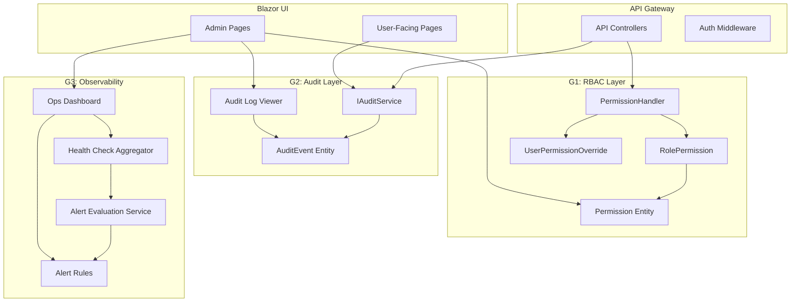

# Epic G - Governance, Admin, Operations (Final-Product Readiness)

This plan implements Epic G from the gap analysis document, covering fine-grained RBAC, audit logging, and observability to achieve production-grade governance and operational readiness.

---

## Current State Analysis

### What Exists

**Authentication/Identity:**

- ASP.NET Core Identity with `AppUser` extending `IdentityUser<Guid>` in [AppUser.cs](src/Shared/AnseoConnect.Data/Entities/AppUser.cs)
- JWT authentication (local) + Azure AD (Entra ID) dual-scheme in [Program.cs](src/Services/AnseoConnect.ApiGateway/Program.cs)
- Multi-tenancy via `ITenantScoped` / `ISchoolScoped` query filters in [AnseoConnectDbContext.cs](src/Shared/AnseoConnect.Data/AnseoConnectDbContext.cs)

**Basic Role-Based Policies (lines 188-248 in Program.cs):**

- `StaffOnly`, `AttendanceAccess`, `CaseManagement`, `SafeguardingAccess`, `ReportingAccess`, `ETBTrustAccess`, `SettingsAdmin`, `TierManagement`, `EvidenceExport`
- Role enum in [StaffRole.cs](src/Shared/AnseoConnect.Data/Entities/StaffRole.cs): `AttendanceAdmin, Teacher, YearHead, Principal, DeputyPrincipal, DLP, ETBTrustAdmin`

**Observability:**

- Basic connector health via `ConnectorHealthService` (Epic F)
- Sync error tracking in `SyncError` entity

### Key Gaps

| Area | Gap | Impact |

|------|-----|--------|

| RBAC | No action-level permissions (view student vs send message vs export evidence) | Cannot differentiate access within roles |

| RBAC | No permission assignment UI for admins | Manual DB edits required |

| Audit | No sensitive read logging (who viewed student X at time Y) | GDPR compliance risk |

| Audit | No export/evidence pack access logging | Cannot prove data access patterns |

| Observability | No centralized health endpoint aggregating all subsystems | Ops must check multiple dashboards |

| Alerting | No unified alert rules for outbox DLQ, deliverability, sync failures | Reactive-only incident response |

---

## G1 - RBAC + Permissions Matrix

### G1.S1 - Permission Model with Scopes and Actions

Create a fine-grained permission system that complements existing role-based policies.

**Permission Taxonomy:**

```
- Students
  - students:view - View student records
  - students:view-sensitive - View sensitive info (address, contact details)
  - students:export - Export student data
  
- Communications
  - comms:view - View message threads
  - comms:send - Send messages
  - comms:approve-templates - Approve message templates
  
- Cases
  - cases:view - View cases
  - cases:manage - Create/update cases
  - cases:assign - Assign cases to staff
  
- Safeguarding
  - safeguarding:view - View safeguarding alerts
  - safeguarding:manage - Manage safeguarding cases
  
- Evidence
  - evidence:generate - Generate evidence packs
  - evidence:export - Download/export evidence packs
  
- SIS Connectors
  - connectors:view - View connector status
  - connectors:configure - Configure connector settings
  - connectors:trigger-sync - Trigger manual sync
  
- Audit
  - audit:view - View audit logs
  - audit:export - Export audit logs
  
- Admin
  - admin:manage-users - Manage staff accounts
  - admin:manage-permissions - Configure permission assignments
  - admin:manage-schools - School settings administration
```

**New Entities:**

```csharp
// src/Shared/AnseoConnect.Data/Entities/Permission.cs
public class Permission
{
    public Guid PermissionId { get; set; }
    public string Code { get; set; } = ""; // e.g., "students:view"
    public string DisplayName { get; set; } = "";
    public string Category { get; set; } = ""; // e.g., "Students"
    public string Description { get; set; } = "";
    public bool IsSystemPermission { get; set; } // Cannot be deleted
}

// src/Shared/AnseoConnect.Data/Entities/RolePermission.cs
public class RolePermission : ITenantScoped
{
    public Guid RolePermissionId { get; set; }
    public Guid TenantId { get; set; }
    public string RoleName { get; set; } = ""; // Maps to IdentityRole
    public Guid PermissionId { get; set; }
    public Permission Permission { get; set; } = null!;
    public Guid? SchoolId { get; set; } // null = all schools in tenant
    public DateTimeOffset GrantedAtUtc { get; set; }
    public string GrantedBy { get; set; } = "";
}

// src/Shared/AnseoConnect.Data/Entities/UserPermissionOverride.cs
public class UserPermissionOverride : ITenantScoped, ISchoolScoped
{
    public Guid OverrideId { get; set; }
    public Guid TenantId { get; set; }
    public Guid SchoolId { get; set; }
    public Guid UserId { get; set; }
    public Guid PermissionId { get; set; }
    public Permission Permission { get; set; } = null!;
    public bool IsGrant { get; set; } // true = grant, false = deny
    public DateTimeOffset ModifiedAtUtc { get; set; }
    public string ModifiedBy { get; set; } = "";
    public string Reason { get; set; } = "";
}
```

**Authorization Handler:**

```csharp
// src/Services/AnseoConnect.ApiGateway/Authorization/PermissionHandler.cs
public class PermissionRequirement : IAuthorizationRequirement
{
    public string PermissionCode { get; }
    public PermissionRequirement(string permissionCode) => PermissionCode = permissionCode;
}

public class PermissionHandler : AuthorizationHandler<PermissionRequirement>
{
    // Checks role permissions + user overrides
    // Caches user permissions per request
}
```

**Admin UI:**

- `Pages/Admin/Permissions.razor` - Permission matrix editor (roles x permissions grid)
- Import/export permissions as JSON for tenant setup

---

## G2 - Audit Logging (GDPR-Compliant)

### G2.S1 - AuditEvent Entity and Instrumentation

Create append-only audit logging for sensitive operations.

**AuditEvent Entity:**

```csharp
// src/Shared/AnseoConnect.Data/Entities/AuditEvent.cs
public class AuditEvent
{
    public Guid AuditEventId { get; set; }
    public Guid TenantId { get; set; }
    public Guid? SchoolId { get; set; }
    
    // Actor information
    public string ActorId { get; set; } = ""; // User ID or "system"
    public string ActorName { get; set; } = "";
    public string ActorType { get; set; } = ""; // Staff, Guardian, System
    public string IpAddress { get; set; } = "";
    public string UserAgent { get; set; } = "";
    
    // Action details
    public string Action { get; set; } = ""; // e.g., "student:viewed", "evidence:exported"
    public string EntityType { get; set; } = ""; // Student, Case, Message, EvidencePack
    public string EntityId { get; set; } = "";
    public string EntityDisplayName { get; set; } = ""; // For display in UI
    
    // Additional context
    public string MetadataJson { get; set; } = "{}"; // Extra details (filters used, export params)
    public DateTimeOffset OccurredAtUtc { get; set; }
    
    // Integrity (optional)
    public string? PreviousEventHash { get; set; }
    public string? EventHash { get; set; }
}
```

**Key Actions to Audit:**

| Action | EntityType | Trigger Point |

|--------|------------|---------------|

| `student:viewed` | Student | StudentDetail page load |

| `student:sensitive-viewed` | Student | Contact info expansion |

| `case:viewed` | Case | CaseDetail page load |

| `case:created` | Case | CaseService.CreateCase |

| `safeguarding:viewed` | SafeguardingAlert | SafeguardingDetail page |

| `message:content-viewed` | Message | MessageDetail page |

| `evidence:generated` | EvidencePack | EvidencePackBuilder.Build |

| `evidence:exported` | EvidencePack | Evidence download |

| `audit:searched` | AuditEvent | Audit log queries |

| `report:exported` | ReportRun | Report artifact download |

| `user:permissions-changed` | AppUser | Permission assignment |

**Audit Service:**

```csharp
// src/Shared/AnseoConnect.Data/Services/AuditService.cs
public interface IAuditService
{
    Task LogAsync(AuditEventBuilder builder, CancellationToken ct = default);
    Task<PagedResult<AuditEvent>> SearchAsync(AuditSearchRequest request, CancellationToken ct = default);
}

public class AuditEventBuilder
{
    public AuditEventBuilder Action(string action) { ... }
    public AuditEventBuilder Entity(string type, string id, string? displayName = null) { ... }
    public AuditEventBuilder Metadata(object metadata) { ... }
    public AuditEventBuilder WithIntegrity() { ... } // Enable hash chain
}
```

**Admin UI:**

- `Pages/Admin/AuditLog.razor` - Searchable audit log viewer with filters (actor, action, entity, date range)
- Export to CSV/Excel with redaction options

---

## G3 - Observability + Alerting

### G3.S1 - Health Aggregation Endpoint

Create a unified health check endpoint aggregating all subsystems.

**Health Checks to Aggregate:**

```csharp
// In Program.cs
builder.Services.AddHealthChecks()
    .AddDbContextCheck<AnseoConnectDbContext>("database")
    .AddCheck<OutboxHealthCheck>("outbox")
    .AddCheck<ConnectorHealthCheck>("sis-connectors")
    .AddCheck<MessageDeliverabilityCheck>("deliverability")
    .AddCheck<ServiceBusHealthCheck>("service-bus");
```

**Custom Health Checks:**

```csharp
// OutboxHealthCheck - DLQ count, pending message age
public class OutboxHealthCheck : IHealthCheck
{
    // Degraded if DLQ > threshold or oldest pending > X hours
}

// MessageDeliverabilityCheck - Recent failure rate
public class MessageDeliverabilityCheck : IHealthCheck
{
    // Degraded if failure rate > threshold in last 24h
}
```

**Endpoints:**

- `GET /health` - ASP.NET Core health check endpoint (JSON)
- `GET /health/ready` - Readiness probe for K8s
- `GET /health/live` - Liveness probe

### G3.S2 - Alert Rules and Notification

Create configurable alert rules with notification channels.

**Alert Rule Entity:**

```csharp
// src/Shared/AnseoConnect.Data/Entities/AlertRule.cs
public class AlertRule : ITenantScoped
{
    public Guid AlertRuleId { get; set; }
    public Guid TenantId { get; set; }
    public string Name { get; set; } = "";
    public string Category { get; set; } = ""; // SIS, Outbox, Deliverability, etc.
    public string ConditionJson { get; set; } = ""; // Threshold conditions
    public string Severity { get; set; } = ""; // Info, Warning, Critical
    public bool IsEnabled { get; set; }
    public string NotificationChannelsJson { get; set; } = "[]"; // Email addresses, webhook URLs
}

// src/Shared/AnseoConnect.Data/Entities/AlertInstance.cs
public class AlertInstance : ITenantScoped
{
    public Guid AlertInstanceId { get; set; }
    public Guid TenantId { get; set; }
    public Guid AlertRuleId { get; set; }
    public DateTimeOffset TriggeredAtUtc { get; set; }
    public DateTimeOffset? ResolvedAtUtc { get; set; }
    public string Status { get; set; } = ""; // Active, Acknowledged, Resolved
    public string DetailsJson { get; set; } = "";
}
```

**Alert Evaluation Service:**

```csharp
// src/Services/AnseoConnect.ApiGateway/Services/AlertEvaluationService.cs
public class AlertEvaluationService : BackgroundService
{
    // Runs every 5 minutes
    // Evaluates all enabled rules
    // Creates AlertInstances for triggered rules
    // Sends notifications via configured channels
}
```

**Admin UI:**

- `Pages/Admin/Alerts.razor` - Alert rule configuration
- `Pages/Admin/OpsDashboard.razor` - Unified operations dashboard showing:
                - Active alerts
                - Outbox queue depth and DLQ count
                - SIS connector health per school
                - Message deliverability rates
                - Recent sync runs and failures

---

## Architecture Diagram



---

## File Changes Summary

| Area | File | Action |

|------|------|--------|

| **Entities** | `src/Shared/AnseoConnect.Data/Entities/Permission.cs` | Create |

| **Entities** | `src/Shared/AnseoConnect.Data/Entities/RolePermission.cs` | Create |

| **Entities** | `src/Shared/AnseoConnect.Data/Entities/UserPermissionOverride.cs` | Create |

| **Entities** | `src/Shared/AnseoConnect.Data/Entities/AuditEvent.cs` | Create |

| **Entities** | `src/Shared/AnseoConnect.Data/Entities/AlertRule.cs` | Create |

| **Entities** | `src/Shared/AnseoConnect.Data/Entities/AlertInstance.cs` | Create |

| **DbContext** | `src/Shared/AnseoConnect.Data/AnseoConnectDbContext.cs` | Add DbSets + config |

| **Migrations** | `src/Shared/AnseoConnect.Data/Migrations/EpicG_Governance.cs` | Create |

| **Services** | `src/Shared/AnseoConnect.Data/Services/AuditService.cs` | Create |

| **Services** | `src/Shared/AnseoConnect.Data/Services/PermissionService.cs` | Create |

| **Auth** | `src/Services/AnseoConnect.ApiGateway/Authorization/PermissionRequirement.cs` | Create |

| **Auth** | `src/Services/AnseoConnect.ApiGateway/Authorization/PermissionHandler.cs` | Create |

| **Health** | `src/Services/AnseoConnect.ApiGateway/Health/OutboxHealthCheck.cs` | Create |

| **Health** | `src/Services/AnseoConnect.ApiGateway/Health/DeliverabilityHealthCheck.cs` | Create |

| **Services** | `src/Services/AnseoConnect.ApiGateway/Services/AlertEvaluationService.cs` | Create |

| **Controllers** | `src/Services/AnseoConnect.ApiGateway/Controllers/AuditController.cs` | Create |

| **Controllers** | `src/Services/AnseoConnect.ApiGateway/Controllers/PermissionsController.cs` | Create |

| **Controllers** | `src/Services/AnseoConnect.ApiGateway/Controllers/AlertsController.cs` | Create |

| **Program.cs** | `src/Services/AnseoConnect.ApiGateway/Program.cs` | Add health checks, handlers |

| **Client** | `src/UI/AnseoConnect.Client/AuditClient.cs` | Create |

| **Client** | `src/UI/AnseoConnect.Client/PermissionsClient.cs` | Create |

| **Client** | `src/UI/AnseoConnect.Client/AlertsClient.cs` | Create |

| **UI** | `src/Web/AnseoConnect.Web/Pages/Admin/Permissions.razor` | Create |

| **UI** | `src/Web/AnseoConnect.Web/Pages/Admin/AuditLog.razor` | Create |

| **UI** | `src/Web/AnseoConnect.Web/Pages/Admin/AlertRules.razor` | Create |

| **UI** | `src/Web/AnseoConnect.Web/Pages/Admin/OpsDashboard.razor` | Create |

---

## Acceptance Criteria

### G1 - RBAC + Permissions

- Permission matrix supports action-level granularity (view, send, export, approve, etc.)
- Roles have default permissions seeded on tenant creation
- User-level overrides can grant or deny specific permissions
- Admin UI allows editing permission matrix per role
- All endpoints enforce permission checks via `[Authorize(Policy = "permission:code")]` or handler

### G2 - Audit Logging

- Sensitive reads (student detail, message content, safeguarding) are logged with actor + timestamp
- Evidence pack generation and export are logged
- Audit search UI allows filtering by actor, action, entity, date range
- Audit export respects RBAC (only users with `audit:export` can download)
- Optional hash chain for tamper evidence

### G3 - Observability + Alerting

- `/health` endpoint returns aggregated status of all subsystems
- Alert rules are configurable per tenant
- Active alerts appear in ops dashboard
- Ops dashboard shows: outbox queue, DLQ count, connector status, deliverability metrics
- Notifications are sent via email/webhook when alerts trigger

---

## Dependencies

- **Epic A (Comms Hub)** - Audit logging hooks into message send/view
- **Epic B (Interventions)** - Audit logging hooks into letter generation, evidence export
- **Epic F (Connectors)** - Health checks integrate with existing `ConnectorHealthService`

---

## Seed Data

On tenant creation, seed default role permissions:

| Role | Default Permissions |

|------|---------------------|

| Teacher | `students:view`, `comms:view` |

| AttendanceAdmin | Above + `comms:send`, `cases:view` |

| YearHead | Above + `cases:manage`, `cases:assign`, `evidence:generate` |

| Principal | All school-level permissions |

| DLP | Above + `safeguarding:*` |

| ETBTrustAdmin | All + multi-school access |