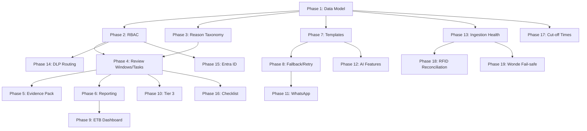

# Full Requirements Implementation Plan

This plan addresses all gaps identified in the Design Brief v1.2 review, organized into logical phases.

## Phase 1: Data Model Extensions

### 1.1 New Entities

Add entities to [AnseoConnect.Data/Entities/](src/Shared/AnseoConnect.Data/Entities/):

- **`SchoolSettings.cs`** - Per-school configuration (cut-off times, autonomy level, policy pack overrides)
- **`WorkTask.cs`** - Work items assigned to staff (linked to Case)
- **`WorkTaskChecklist.cs`** - Checklist items for tasks
- **`ReasonCode.cs`** - Absence reason taxonomy (TUSLA/DfE codes)
- **`EvidencePack.cs`** - Generated evidence exports
- **`IngestionSyncLog.cs`** - Sync health tracking (errors, mismatch rates)
- **`MessageTemplate.cs`** - Policy-driven templates with variables
- **`NotificationRecipient.cs`** - DLP/safeguarding routing configuration

### 1.2 Entity Updates

Extend existing entities:

- **`Case.cs`** - Add `ReviewDueAtUtc`, `AssignedToUserId`, `EscalatedAtUtc`, `BarrierCodes`
- **`School.cs`** - Add `ETBTrustId`, `SyncStatus`, `SyncErrorCount`
- **`AppUser.cs`** - Add `Role` enum property for RBAC
- **`SafeguardingAlert.cs`** - Add `RoutedToUserIds`, `AcknowledgedAtUtc`, `ChecklistProgress`

### 1.3 Migration

Create migration `Step6_AddFullRequirements` in [AnseoConnect.Data/Migrations/](src/Shared/AnseoConnect.Data/Migrations/)

---

## Phase 2: RBAC Implementation

### 2.1 Define Role Enum

Create `StaffRole` enum in [AnseoConnect.Data/Entities/](src/Shared/AnseoConnect.Data/Entities/):

```csharp
public enum StaffRole
{
    AttendanceAdmin,    // Daily lists, contact, logging
    Teacher,            // Basic read access
    YearHead,           // Targeted interventions, meetings
    Principal,          // Oversight, reporting
    DeputyPrincipal,
    DLP,                // Safeguarding alerts
    ETBTrustAdmin       // Multi-school roll-ups
}
```

### 2.2 Authorization Policies

Update [ApiGateway/Program.cs](src/Services/AnseoConnect.ApiGateway/Program.cs):

```csharp
options.AddPolicy("AttendanceAccess", p => p.RequireRole("AttendanceAdmin", "YearHead", "Principal", "DeputyPrincipal", "DLP"));
options.AddPolicy("CaseManagement", p => p.RequireRole("YearHead", "Principal", "DeputyPrincipal", "DLP"));
options.AddPolicy("SafeguardingAccess", p => p.RequireRole("DLP", "Principal", "DeputyPrincipal"));
options.AddPolicy("ReportingAccess", p => p.RequireRole("Principal", "DeputyPrincipal", "ETBTrustAdmin"));
options.AddPolicy("ETBTrustAccess", p => p.RequireRole("ETBTrustAdmin"));
options.AddPolicy("SettingsAdmin", p => p.RequireRole("Principal", "DeputyPrincipal"));
```

### 2.3 Seed Roles

Add role seeding in [DBMigrator/Program.cs](tools/DBMigrator/Program.cs)

---

## Phase 3: Reason Taxonomy (Ireland/TUSLA)

### 3.1 Policy Pack Data

Create [policy-packs/ie/IE-ANSEO-DEFAULT/1.3.0/reason-taxonomy.json](policy-packs/ie/IE-ANSEO-DEFAULT/1.3.0/reason-taxonomy.json):

```json
{
  "enabled": true,
  "countryDefaults": {
    "IE": {
      "scheme": "TUSLA_TESS",
      "version": "2026",
      "codes": [
        { "code": "ILL", "label": "Illness", "type": "AUTHORISED" },
        { "code": "MED", "label": "Medical/Dental appointment", "type": "AUTHORISED" },
        { "code": "FAM", "label": "Family reasons", "type": "AUTHORISED" },
        { "code": "REL", "label": "Religious observance", "type": "AUTHORISED" },
        { "code": "TRA", "label": "Traveller (traditional activities)", "type": "AUTHORISED" },
        { "code": "SUS", "label": "Suspension", "type": "AUTHORISED" },
        { "code": "EXP", "label": "Expulsion", "type": "AUTHORISED" },
        { "code": "UNE", "label": "Unexplained absence", "type": "UNAUTHORISED" },
        { "code": "TRU", "label": "Truancy", "type": "UNAUTHORISED" },
        { "code": "LAT", "label": "Late arrival (after roll)", "type": "UNAUTHORISED" },
        { "code": "HOL", "label": "Holiday during term", "type": "UNAUTHORISED" },
        { "code": "OTH", "label": "Other", "type": "OTHER" }
      ]
    }
  }
}
```

### 3.2 Taxonomy Service

Create `ReasonTaxonomyService` in [AnseoConnect.PolicyRuntime/](src/Shared/AnseoConnect.PolicyRuntime/) to load and validate codes

---

## Phase 4: Review Windows and Tasks

### 4.1 Case Review Logic

Update [CaseService.cs](src/Services/AnseoConnect.Workflow/Services/CaseService.cs):

- Add `SetReviewWindow(caseId, daysFromNow)` method
- Add `GetOverdueReviews()` query
- Add automatic review window based on tier (Tier 1: 5 days, Tier 2: 10 days, Tier 3: 3 days)

### 4.2 Task Service

Create `TaskService.cs` in [AnseoConnect.Workflow/Services/](src/Services/AnseoConnect.Workflow/Services/):

- `CreateTaskAsync(caseId, title, assignedRole, dueDate, checklistId)`
- `CompleteTaskAsync(taskId, notes)`
- `GetTasksDueToday()`
- `GetOverdueTasks()`

### 4.3 Task Consumer

Create `TaskDueConsumer.cs` to publish reminder notifications when tasks are overdue

---

## Phase 5: Evidence Pack Export

### 5.1 Evidence Pack Service

Create `EvidencePackService.cs` in [AnseoConnect.Workflow/Services/](src/Services/AnseoConnect.Workflow/Services/):

```csharp
public async Task<EvidencePackDto> GenerateEvidencePackAsync(Guid caseId)
{
    // Collect: attendance history, communications, interventions, timeline, outcomes
    // Generate PDF or structured JSON export
}
```

### 5.2 API Endpoint

Add to [CasesController.cs](src/Services/AnseoConnect.ApiGateway/Controllers/CasesController.cs):

```csharp
[HttpGet("{caseId}/evidence-pack")]
[Authorize(Policy = "CaseManagement")]
public async Task<IActionResult> GetEvidencePack(Guid caseId)
```

### 5.3 PDF Generation

Add `QuestPDF` NuGet package for PDF generation

---

## Phase 6: Reporting and Dashboards

### 6.1 Reporting Service

Create `ReportingService.cs` in [AnseoConnect.ApiGateway/Services/](src/Services/AnseoConnect.ApiGateway/Services/):

- `GetSchoolDashboardMetrics()` - attendance trend, persistent absence %, open cases by tier
- `GetCommsEffectivenessMetrics()` - same-day contact rate, reply rate, opt-out rate
- `GetETBRollupMetrics(etbId)` - aggregated metrics across schools

### 6.2 API Endpoints

Create `ReportsController.cs` in [ApiGateway/Controllers/](src/Services/AnseoConnect.ApiGateway/Controllers/):

```csharp
[HttpGet("school-dashboard")]
[Authorize(Policy = "ReportingAccess")]
public async Task<IActionResult> GetSchoolDashboard()

[HttpGet("etb-dashboard")]
[Authorize(Policy = "ETBTrustAccess")]
public async Task<IActionResult> GetETBDashboard()

[HttpGet("export")]
[Authorize(Policy = "ReportingAccess")]
public async Task<IActionResult> ExportReport([FromQuery] string format = "csv")
```

### 6.3 Update UI

Update [Reports.razor](src/Web/AnseoConnect.Web/Pages/Reports.razor) to call real API endpoints

---

## Phase 7: Message Templates with Variables

### 7.1 Template Engine

Create `TemplateEngine.cs` in [AnseoConnect.PolicyRuntime/](src/Shared/AnseoConnect.PolicyRuntime/):

- Load templates from policy pack
- Variable substitution: `{{StudentName}}`, `{{Date}}`, `{{SchoolName}}`
- Tone constraint validation

### 7.2 Policy Pack Templates

Add to [policy-packs/ie/IE-ANSEO-DEFAULT/1.3.0/templates.json](policy-packs/ie/IE-ANSEO-DEFAULT/1.3.0/templates.json):

```json
{
  "templates": [
    {
      "id": "ABSENCE_FIRST_CONTACT",
      "channel": "SMS",
      "subject": null,
      "body": "Dear {{GuardianTitle}}, {{StudentFirstName}} was marked absent on {{Date}}. Please reply with reason or contact the school.",
      "toneConstraints": ["professional", "concise"],
      "maxLength": 160
    }
  ]
}
```

### 7.3 Update MessageService

Update [MessageService.cs](src/Services/AnseoConnect.Comms/Services/MessageService.cs) to use `TemplateEngine`

---

## Phase 8: Channel Fallback and Retry

### 8.1 Retry Policy

Add Polly retry policies to [MessageService.cs](src/Services/AnseoConnect.Comms/Services/MessageService.cs):

```csharp
private static readonly AsyncRetryPolicy RetryPolicy = Policy
    .Handle<HttpRequestException>()
    .WaitAndRetryAsync(3, attempt => TimeSpan.FromSeconds(Math.Pow(2, attempt)));
```

### 8.2 Channel Fallback Logic

Implement fallback in `MessageService`:

```csharp
public async Task SendWithFallbackAsync(SendMessageRequestedV1 command)
{
    var channels = GetChannelPriority(command.MessageType); // SMS -> EMAIL -> WHATSAPP
    foreach (var channel in channels)
    {
        if (await TrySendAsync(command with { Channel = channel }))
            return;
    }
    await CreateFailedMessageAsync(command, "ALL_CHANNELS_FAILED");
}
```

### 8.3 Dead Letter Queue

Configure Service Bus DLQ handling for failed messages

---

## Phase 9: ETB/Trust Dashboard

### 9.1 Data Model

Add `ETBTrust` entity and link to `School`:

```csharp
public class ETBTrust
{
    public Guid ETBTrustId { get; set; }
    public Guid TenantId { get; set; }
    public string Name { get; set; }
    public ICollection<School> Schools { get; set; }
}
```

### 9.2 Roll-up Queries

Add to `ReportingService`:

- Aggregate attendance across all schools in ETB
- Benchmark comparisons
- Cohort analysis

### 9.3 UI Page

Create [ETBDashboard.razor](src/Web/AnseoConnect.Web/Pages/ETBDashboard.razor) for multi-school view

---

## Phase 10: Tier 3 Escalation

### 10.1 Escalation Logic

Update [CaseService.cs](src/Services/AnseoConnect.Workflow/Services/CaseService.cs):

```csharp
public async Task<bool> EscalateToTier3Async(Guid caseId, string reason)
{
    // Tier 3 requires: evidence pack generated, DLP notified
    await GenerateEvidencePackAsync(caseId);
    await NotifyDLPAsync(caseId, "TIER_3_ESCALATION");
    // Update case tier and create timeline event
}
```

### 10.2 Tier Thresholds

Add configurable thresholds to `SchoolSettings`:

- Tier 2 threshold: X unexplained absences in Y days
- Tier 3 threshold: Z consecutive days or % absence rate

---

## Phase 11: WhatsApp Channel

### 11.1 Twilio WhatsApp Sender

Create `TwilioWhatsAppSender.cs` in [AnseoConnect.Comms/Services/](src/Services/AnseoConnect.Comms/Services/):

```csharp
public async Task<WhatsAppSendResult> SendWhatsAppAsync(string to, string body)
{
    // Use Twilio WhatsApp API (prefix number with "whatsapp:")
    var message = await MessageResource.CreateAsync(
        to: new PhoneNumber($"whatsapp:{to}"),
        from: new PhoneNumber($"whatsapp:{_fromNumber}"),
        body: body
    );
}
```

### 11.2 WhatsApp Webhook

Add `TwilioWhatsAppWebhookController.cs` for delivery/reply handling

### 11.3 Update MessageService

Add WhatsApp routing in `MessageService.ProcessMessageRequestAsync`

---

## Phase 12: AI Features (Azure OpenAI)

### 12.1 AI Service

Create `AnseoConnect.AI` project with:

- **`AzureOpenAIService.cs`** - Client wrapper
- **`MessageDraftingService.cs`** - Draft messages within templates
- **`CaseSummarizationService.cs`** - Summarize case timelines
- **`ReplyClassificationService.cs`** - Classify guardian replies to reason codes
- **`PrioritizationService.cs`** - Rank daily action list

### 12.2 Autonomy Levels

Implement A0/A1/A2 in `SchoolSettings`:

```csharp
public enum AutonomyLevel
{
    A0_Advisory,      // Drafts/recommendations only
    A1_AutoMessage,   // Can send messages within policy
    A2_AutoEscalate   // Can open/advance cases (never safeguarding)
}
```

### 12.3 AI Guardrails

Create `AIGuardrails.cs` to enforce:

- Safeguarding always A0
- Template/tone constraints
- Human approval for sensitive actions

---

## Phase 13: Ingestion Health Dashboard

### 13.1 Sync Health Tracking

Update [IngestionService.cs](src/Services/AnseoConnect.Ingestion.Wonde/Services/IngestionService.cs):

- Log sync results to `IngestionSyncLog`
- Track: last sync time, records processed, errors, mismatch rate

### 13.2 Health API

Create `IngestionHealthController.cs`:

```csharp
[HttpGet("health")]
public async Task<IActionResult> GetIngestionHealth()
// Returns: last sync per school, error counts, missing entities
```

### 13.3 UI Page

Create [IngestionHealth.razor](src/Web/AnseoConnect.Web/Pages/IngestionHealth.razor)

---

## Phase 14: DLP Recipient Routing

### 14.1 Notification Routing Service

Create `NotificationRoutingService.cs` in [AnseoConnect.Workflow/Services/](src/Services/AnseoConnect.Workflow/Services/):

- Load routing rules from policy pack
- Route safeguarding alerts to configured DLP/Principal
- Escalate to secondary if no acknowledgement within SLA

### 14.2 In-App Notifications

Create `Notification` entity and `NotificationService` for in-app alerts

---

## Phase 15: Entra ID Authentication

### 15.1 Add Microsoft.Identity.Web

Update [ApiGateway.csproj](src/Services/AnseoConnect.ApiGateway/AnseoConnect.ApiGateway.csproj):

```xml
<PackageReference Include="Microsoft.Identity.Web" Version="3.*" />
```

### 15.2 Configure Dual Auth

Update [Program.cs](src/Services/AnseoConnect.ApiGateway/Program.cs):

```csharp
.AddMicrosoftIdentityWebApi(builder.Configuration.GetSection("AzureAd"))
```

### 15.3 Claim Mapping

Map Entra claims to tenant/school context

---

## Phase 16: Checklist Completion

### 16.1 Fix Placeholder

Update [CasesController.cs](src/Services/AnseoConnect.ApiGateway/Controllers/CasesController.cs):

```csharp
[HttpPatch("{caseId}/checklist/{checklistId}/items/{itemId}/complete")]
public async Task<IActionResult> MarkChecklistItemComplete(
    Guid caseId, string checklistId, string itemId, [FromBody] CompleteChecklistRequest request)
{
    await _caseService.CompleteChecklistItemAsync(caseId, checklistId, itemId, request.Notes);
    return Ok();
}
```

### 16.2 Checklist Progress Tracking

Add `ChecklistProgress` JSON column to `SafeguardingAlert` and `WorkTask`

---

## Phase 17: Configurable Cut-off Times

### 17.1 School Settings

Add to `SchoolSettings`:

```csharp
public TimeOnly AMCutoffTime { get; set; } = new(10, 30);
public TimeOnly PMCutoffTime { get; set; } = new(14, 30);
```

### 17.2 Update Absence Detection

Update [AbsenceDetectionService.cs](src/Services/AnseoConnect.Workflow/Services/AbsenceDetectionService.cs) to use per-school cut-offs

---

## Phase 18: RFID Reconciliation

### 18.1 Reconciliation Service

Create `AttendanceReconciliationService.cs`:

- Compare RFID attendance vs SIS marks
- Flag mismatches for review
- Calculate mismatch rate

### 18.2 Reconciliation UI

Add reconciliation panel to ingestion health dashboard

---

## Phase 19: Wonde Sync Fail-safe

### 19.1 Sync Status Tracking

Add `SyncStatus` enum to `School`:

```csharp
public enum SyncStatus { Healthy, Warning, Failed, Paused }
```

### 19.2 Fail-safe Logic

Update ingestion to:

- Set `SyncStatus = Failed` on errors
- Pause automated messaging when status is Failed
- Notify admins via email/in-app

---

## Files to Create

| File | Purpose |

|------|---------|

| `Entities/SchoolSettings.cs` | Per-school configuration |

| `Entities/WorkTask.cs` | Work items |

| `Entities/WorkTaskChecklist.cs` | Task checklists |

| `Entities/ReasonCode.cs` | Reason taxonomy |

| `Entities/EvidencePack.cs` | Evidence exports |

| `Entities/IngestionSyncLog.cs` | Sync health |

| `Entities/MessageTemplate.cs` | Templates |

| `Entities/NotificationRecipient.cs` | Routing config |

| `Entities/ETBTrust.cs` | ETB/Trust grouping |

| `Entities/Notification.cs` | In-app notifications |

| `Services/TaskService.cs` | Work task management |

| `Services/EvidencePackService.cs` | Evidence generation |

| `Services/ReportingService.cs` | Metrics calculation |

| `Services/NotificationRoutingService.cs` | DLP routing |

| `Services/AttendanceReconciliationService.cs` | RFID reconciliation |

| `PolicyRuntime/TemplateEngine.cs` | Template variables |

| `PolicyRuntime/ReasonTaxonomyService.cs` | Taxonomy loading |

| `Comms/Services/TwilioWhatsAppSender.cs` | WhatsApp channel |

| `AI/AzureOpenAIService.cs` | AI client |

| `AI/MessageDraftingService.cs` | AI drafting |

| `AI/CaseSummarizationService.cs` | AI summaries |

| `AI/ReplyClassificationService.cs` | AI classification |

| `AI/PrioritizationService.cs` | AI prioritization |

| `AI/AIGuardrails.cs` | AI safety |

| `Controllers/ReportsController.cs` | Reporting endpoints |

| `Controllers/IngestionHealthController.cs` | Sync health |

| `Controllers/TasksController.cs` | Task endpoints |

| `Pages/ETBDashboard.razor` | ETB view |

| `Pages/IngestionHealth.razor` | Health dashboard |

| `policy-packs/ie/.../reason-taxonomy.json` | TUSLA codes |

| `policy-packs/ie/.../templates.json` | Message templates |

---

## Execution Order

