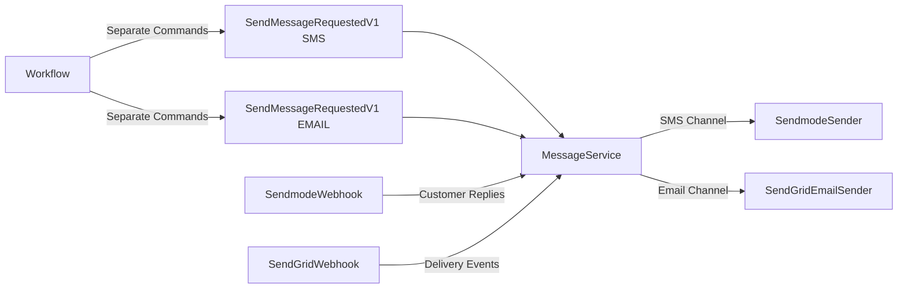

# Replace Twilio SMS with Sendmode SMS and Add SendGrid Email Support

## Overview

Replace Twilio SMS implementation with Sendmode SMS (for Ireland long number support) and add Twilio SendGrid Email as an additional channel. Support dual-channel sending (SMS + Email) when guardian has both contact methods.

## Architecture Changes

## Key Changes

1. **Replace Twilio SMS with Sendmode SMS**

   - Remove Twilio NuGet package
   - Implement Sendmode REST API integration
   - Update webhook handling for Sendmode customer replies format

2. **Add Twilio SendGrid Email Support**

   - Add SendGrid NuGet package
   - Implement SendGrid Email API integration
   - Support HTML and plain text email templates

3. **Update MessageService for Multi-Channel**

   - Refactor to use channel-specific senders
   - Support both SMS (Sendmode) and EMAIL (SendGrid) channels independently

4. **Update Workflow for Dual Send**

   - Modify AttendanceMarksIngestedConsumer to send separate commands per channel
   - Send SMS command if guardian has mobile number
   - Send EMAIL command if guardian has email address

5. **Webhook Handling**

   - Replace TwilioWebhookController with SendmodeWebhookController
   - Handle Sendmode customer replies (format: `?mobilenumber=...&command=...&sentto=...`)
   - Add SendGrid webhook support (optional, for delivery events)

## Implementation Steps

### Step 1: Replace Twilio SMS with Sendmode SMS

**Files to Modify:**

- [src/Services/AnseoConnect.Comms/AnseoConnect.Comms.csproj](src/Services/AnseoConnect.Comms/AnseoConnect.Comms.csproj) - Remove Twilio package, add HTTP client support
- [src/Services/AnseoConnect.Comms/Services/TwilioSender.cs](src/Services/AnseoConnect.Comms/Services/TwilioSender.cs) → **Rename/Replace** with `SendmodeSender.cs`
- [src/Services/AnseoConnect.Comms/Services/MessageService.cs](src/Services/AnseoConnect.Comms/Services/MessageService.cs) - Update to use SendmodeSender instead of TwilioSender
- [src/Services/AnseoConnect.Comms/Program.cs](src/Services/AnseoConnect.Comms/Program.cs) - Update configuration and DI registration
- [src/Services/AnseoConnect.ApiGateway/Controllers/TwilioWebhookController.cs](src/Services/AnseoConnect.ApiGateway/Controllers/TwilioWebhookController.cs) → **Replace** with `SendmodeWebhookController.cs`

**Key Tasks:**

1. Create `SendmodeSender` service using Sendmode REST API

   - Based on [Sendmode REST API docs](https://developers.sendmode.com/restdocs)
   - Use HTTP POST to Sendmode API endpoint
   - Authenticate using username/password or API key (check Sendmode docs)
   - Handle response and extract message ID
   - Store provider as "SENDMODE" in Message entity

2. Update webhook controller for Sendmode customer replies

   - Based on [Sendmode customer replies docs](https://developers.sendmode.com/restdocs/customerreplies)
   - Handle query string parameters: `mobilenumber`, `command`, `sentto`
   - Return "True" in HTML response (Sendmode requirement)
   - Map to existing GuardianReplyReceivedV1 event flow
   - Update opt-out detection logic

3. Update MessageService channel handling

   - Keep SMS channel support but use SendmodeSender
   - Update provider field from "TWILIO" to "SENDMODE"
   - Update error codes from "TWILIO_ERROR" to "SENDMODE_ERROR"

4. Update configuration

   - Replace Twilio config with Sendmode config:
     - `Sendmode:Username` or `Sendmode:ApiKey`
     - `Sendmode:Password` (if username/password auth)
     - `Sendmode:ApiUrl` (e.g., `https://api.sendmode.com`)
   - Update environment variable names:
     - `SENDMODE_USERNAME` or `SENDMODE_API_KEY`
     - `SENDMODE_PASSWORD`
     - `SENDMODE_API_URL`

### Step 2: Add Twilio SendGrid Email Support

**Files to Create:**

- [src/Services/AnseoConnect.Comms/Services/SendGridEmailSender.cs](src/Services/AnseoConnect.Comms/Services/SendGridEmailSender.cs) - New service

**Files to Modify:**

- [src/Services/AnseoConnect.Comms/AnseoConnect.Comms.csproj](src/Services/AnseoConnect.Comms/AnseoConnect.Comms.csproj) - Add SendGrid NuGet package
- [src/Services/AnseoConnect.Comms/Services/MessageService.cs](src/Services/AnseoConnect.Comms/Services/MessageService.cs) - Add EMAIL channel support
- [src/Services/AnseoConnect.Comms/Program.cs](src/Services/AnseoConnect.Comms/Program.cs) - Add SendGrid configuration and DI

**Key Tasks:**

1. Create `SendGridEmailSender` service

   - Use SendGrid .NET SDK (`SendGrid` NuGet package)
   - Authenticate using API key
   - Support HTML and plain text email content
   - Handle email subject, from/to addresses
   - Map SendGrid response status to Message entity status

2. Update MessageService for EMAIL channel

   - Add SendGridEmailSender dependency
   - Handle EMAIL channel in ProcessMessageRequestAsync
   - Check guardian.Email field (already exists in Guardian entity)
   - Generate email content (HTML and plain text versions)
   - Store provider as "SENDGRID" in Message entity

3. Update email message generation

   - Create email templates (HTML and plain text)
   - Support email-specific formatting (subject line, HTML body)
   - Reuse template data from SendMessageRequestedV1

4. Add SendGrid configuration

   - `SendGrid:ApiKey` - SendGrid API key
   - `SendGrid:FromEmail` - Verified sender email address
   - `SendGrid:FromName` - Sender display name (e.g., "Anseo Connect")
   - Environment variables:
     - `SENDGRID_API_KEY`
     - `SENDGRID_FROM_EMAIL`
     - `SENDGRID_FROM_NAME`

5. Add SendGrid webhook support (optional for v0.1)

   - Create `SendGridWebhookController` for delivery events
   - Handle SendGrid Events Webhook format (JSON payload)
   - Map to MessageDeliveryUpdatedV1 event
   - Note: SendGrid Events Webhook is different from SMS webhooks - uses JSON payloads

### Step 3: Refactor MessageService for Channel Routing

**Files to Modify:**

- [src/Services/AnseoConnect.Comms/Services/MessageService.cs](src/Services/AnseoConnect.Comms/Services/MessageService.cs)

**Key Tasks:**

1. Refactor ProcessMessageRequestAsync to route by channel

   - Create channel-specific send methods:
     - `SendSmsAsync()` - Uses SendmodeSender
     - `SendEmailAsync()` - Uses SendGridEmailSender
   - Route based on command.Channel field
   - Update error handling to be channel-agnostic

2. Update provider tracking

   - Set Provider field based on channel: "SENDMODE" for SMS, "SENDGRID" for EMAIL
   - Update error codes to be provider-specific

3. Ensure consent evaluation works for both channels

   - Consent state is already channel-specific (Channel field in ConsentState entity)
   - Policy pack evaluation should already support EMAIL channel (check ConsentEvaluator)

### Step 4: Update Workflow for Dual-Channel Sending

**Files to Modify:**

- [src/Services/AnseoConnect.Workflow/Consumers/AttendanceMarksIngestedConsumer.cs](src/Services/AnseoConnect.Workflow/Consumers/AttendanceMarksIngestedConsumer.cs)

**Key Tasks:**

1. Modify absence processing to send per channel

   - After getting guardian, check available contact methods:
     - If guardian.MobileE164 exists → send SMS command
     - If guardian.Email exists → send EMAIL command
   - Send separate SendMessageRequestedV1 commands for each channel
   - Use same CaseId, StudentId, GuardianId, TemplateData for both commands
   - Only Channel field differs ("SMS" vs "EMAIL")

2. Update template data for email

   - Email messages may need different template data (e.g., HTML formatting)
   - Consider email-specific fields in TemplateData dictionary
   - Keep SMS template data as-is (simple text)

### Step 5: Update Webhook Controllers

**Files to Replace:**

- [src/Services/AnseoConnect.ApiGateway/Controllers/TwilioWebhookController.cs](src/Services/AnseoConnect.ApiGateway/Controllers/TwilioWebhookController.cs) → **Replace** with SendmodeWebhookController

**Files to Create:**

- [src/Services/AnseoConnect.ApiGateway/Controllers/SendmodeWebhookController.cs](src/Services/AnseoConnect.ApiGateway/Controllers/SendmodeWebhookController.cs) - New controller
- [src/Services/AnseoConnect.ApiGateway/Controllers/SendGridWebhookController.cs](src/Services/AnseoConnect.ApiGateway/Controllers/SendGridWebhookController.cs) - Optional, for delivery events

**Key Tasks:**

1. Create SendmodeWebhookController

   - Route: `/webhooks/sendmode/reply`
   - Handle GET/POST with query parameters (per Sendmode docs):
     - `mobilenumber` - Phone number reply came from
     - `command` - SMS reply text
     - `sentto` - Phone number message was sent to
   - Return "True" as plain text response (Sendmode requirement)
   - Map to GuardianReplyReceivedV1 event (same as current Twilio flow)
   - Update opt-out detection and consent state updates
   - Update UpdatedBy field to "SENDMODE_WEBHOOK"

2. Handle Sendmode customer replies

   - Find guardian by phone number (normalize to E.164)
   - Link reply to most recent SMS message for guardian
   - Detect opt-out keywords (STOP, UNSUBSCRIBE, etc.)
   - Update consent state if opt-out detected
   - Publish GuardianReplyReceivedV1 event

3. Add SendGrid webhook (optional for v0.1)

   - Route: `/webhooks/sendgrid/events`
   - Handle SendGrid Events Webhook (JSON payload)
   - Parse delivery events (delivered, bounced, opened, etc.)
   - Map to MessageDeliveryUpdatedV1 event
   - Update message status in database
   - Note: Requires SendGrid Events Webhook configuration in SendGrid dashboard

### Step 6: Update Configuration and Documentation

**Files to Modify:**

- [src/Services/AnseoConnect.Comms/appsettings.json](src/Services/AnseoConnect.Comms/appsettings.json) - Update config placeholders
- [src/Services/AnseoConnect.Comms/appsettings.Development.json](src/Services/AnseoConnect.Comms/appsettings.Development.json) - Update dev config
- [scripts/setup-dev-secrets.ps1](scripts/setup-dev-secrets.ps1) - Update for new providers
- [docs/DEPLOYMENT_GUIDE_v0.1.md](docs/DEPLOYMENT_GUIDE_v0.1.md) - Update configuration instructions

**Key Tasks:**

1. Update appsettings.json placeholders

   - Remove Twilio SMS configuration
   - Add Sendmode configuration
   - Add SendGrid configuration

2. Update environment variable documentation

   - Document Sendmode credentials
   - Document SendGrid credentials
   - Update deployment guides

3. Update webhook URL documentation

   - Sendmode customer reply URL: `https://<apigateway-url>/webhooks/sendmode/reply`
   - SendGrid Events Webhook URL (optional): `https://<apigateway-url>/webhooks/sendgrid/events`

## Testing Considerations

1. **Sendmode SMS Testing**

   - Test SMS sending with valid Ireland phone numbers
   - Test webhook handling for customer replies
   - Verify opt-out keyword detection
   - Test with various phone number formats

2. **SendGrid Email Testing**

   - Test email sending with verified sender
   - Verify HTML and plain text rendering
   - Test email delivery and bounce handling
   - Verify webhook events (if implemented)

3. **Dual-Channel Testing**

   - Test guardian with phone only → SMS only
   - Test guardian with email only → EMAIL only
   - Test guardian with both → Both channels receive messages
   - Verify separate message records created per channel

4. **Integration Testing**

   - End-to-end flow: absence detection → dual send → both messages delivered
   - Verify consent blocking works for both channels independently
   - Test opt-out handling for SMS (webhook) and EMAIL (unsubscribe)

## Migration Notes

- **No database migration required** - Message entity already supports Provider field (string)
- **Backward compatibility**: Existing messages with Provider="TWILIO" will remain in database
- **Consent states**: Channel-specific, so existing SMS consent states remain valid
- **Configuration migration**: Need to update environment variables/user secrets from Twilio to Sendmode/SendGrid

## Dependencies

- **Sendmode**: HTTP REST API (no NuGet package needed, use HttpClient)
- **SendGrid**: NuGet package `SendGrid` (official SDK)
- **Twilio package**: Remove from AnseoConnect.Comms.csproj

## Notes

1. **Sendmode API Details** (from docs):

   - Customer replies webhook: Query string format `?mobilenumber=...&command=...&sentto=...`
   - Must return "True" in HTML/response
   - Configure in Sendmode Settings → API Settings → Post Replies to URL

2. **SendGrid Email Details**:

   - Uses API key authentication
   - Requires verified sender email address
   - Supports HTML and plain text content
   - Events Webhook optional but recommended for delivery tracking

3. **Dual Send Strategy**:

   - Workflow sends separate commands per channel (explicit)
   - Each channel processed independently by MessageService
   - Separate message records created per channel
   - Consent evaluated per channel independently

4. **Webhook Security** (v0.1):

   - No authentication required (as per user preference)
   - For production, consider signature validation or API key authentication